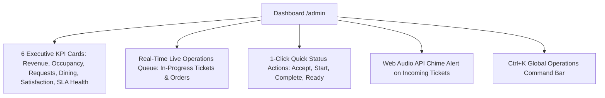

# Hotel Operations Command Center — Staff & Manager Guide

## 1. Architectural Philosophy: Actionable Operations, Not Static CRUD
Hotel staff do not need passive tabular reports—they need an **Active Hospitality Dispatch Center**. The admin interface is designed with a sleek, low-fatigue slate/amber command aesthetic optimized for front-desk terminals, manager laptops, and staff tablets.

---

## 2. Command Center Dashboard (`/admin`)

### Key Elements:
1. **Live Executive KPIs**:
   - **Today's Revenue**: Live gross totals from completed dining orders.
   - **Room Occupancy**: Real-time ratio of occupied rooms vs total inventory.
   - **Active Service Requests**: Real-time count of pending or in-progress tickets.
   - **Kitchen Orders**: Active dining tickets awaiting preparation or delivery.
   - **Guest Satisfaction**: Percentage of positive reviews logged during current stay.
   - **SLA Breach Warnings**: Immediate red badge warning if any service request has exceeded its target resolution window.

2. **Live Operations Queue**:
   Staff see an immediate, unified feed of pending service tickets and food orders. Each ticket shows:
   - Room number and guest moniker.
   - Elapsed wait time (e.g. `2m ago`, `14m ago`).
   - SLA countdown.
   - One-click actionable status buttons (`Accept`, `Start Working`, `Mark Completed`).

3. **Audio Alert Chime**:
   A synthesized two-tone chime (587 Hz → 880 Hz harmonic) plays via HTML5 Web Audio API whenever new tickets arrive. Staff can toggle sound on/off with persistent browser preference storage.

4. **Ctrl+K Global Command Search**:
   Staff can press `Ctrl+K` from any screen to search across:
   - Room numbers (e.g. `101`, `204`).
   - Active ticket IDs (e.g. `SR-`).
   - Guest requests, dining tickets, and menu items.
   - Instant keyboard navigation to the corresponding room detail or ticket view.

---

## 3. Dedicated Operational Workspaces

### Room Operations & Floor Inventory (`/admin/rooms`)
- Filter rooms by status (`Available`, `Occupied`, `Cleaning`, `Maintenance`).
- Detail page showing room QR code, direct guest stay link, historical scan analytics, active tickets, and dining tabs.
- Quick status switcher allowing housekeeping to mark rooms clean or front desk to mark rooms occupied.

### Service Ticket Dispatch (`/admin/requests`)
- Automatic smart routing to responsible department (`Housekeeping`, `Maintenance`, `Front Desk`, `Concierge`).
- Target response and resolution timestamps automatically derived from the service catalog.
- Color-coded SLA breach warnings.
- Immutable status transition audit trail.

### Kitchen & In-Room Dining Dispatch (`/admin/orders`)
- Kitchen display system layout showing item lists, special instructions, and guest room numbers.
- One-click workflow: `Pending` → `Accepted` → `Preparing` → `Ready for Delivery` → `Delivered`.

### QR Code Management & Print Center (`/admin/qr-center`)
- Full inventory of all room and hotel QR tokens.
- Instant vector SVG preview and download.
- Printable A4 tent-card layout formatted for commercial hotel printers.

### Multi-Property Switcher (`/admin/switch-hotel/{id}`)
- Platform operators and chain general managers can instantly switch between properties without logging out.
- Header badge displays active hotel name and city at all times.
