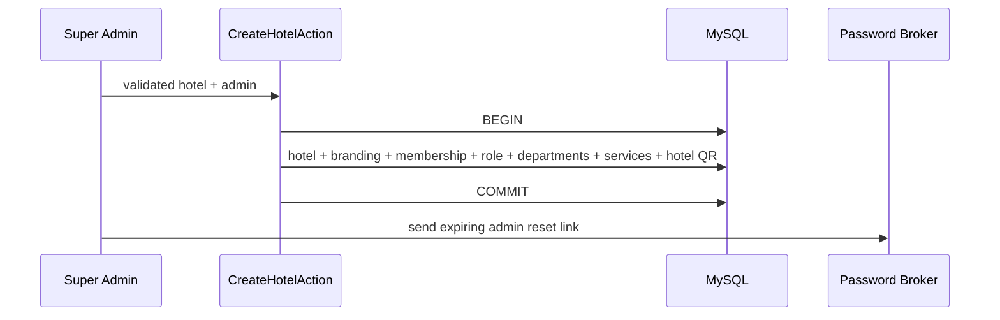
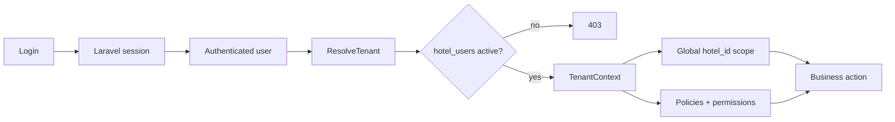
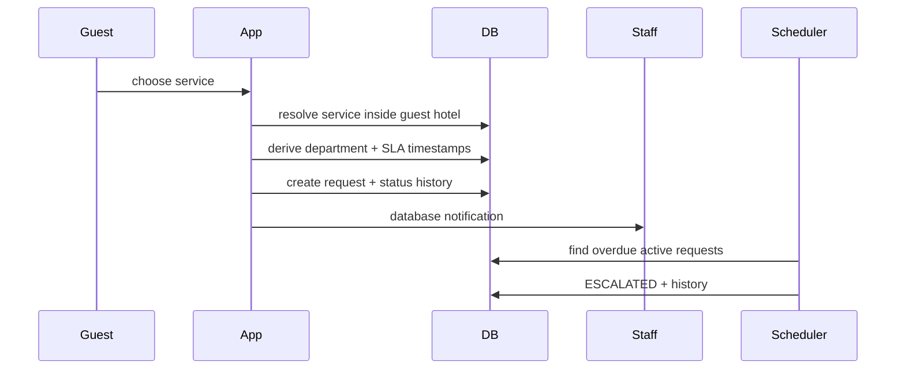
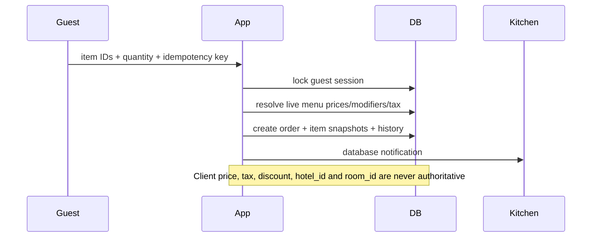
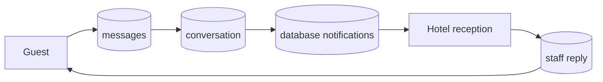

# Architecture
```mermaid
flowchart LR
 Guest[Guest mobile browser] --> QR[/g/{opaque token}]
 QR --> Laravel[Laravel 13]
 Admin[Hotel staff browser] --> Laravel
 Platform[Super Admin] --> Laravel
 Laravel --> Auth[Auth + RBAC]
 Laravel --> Tenant[Tenant Context + Policies]
 Tenant --> MySQL[(MySQL 8)]
 Laravel --> Storage[Laravel Storage]
 Laravel --> Cron[Hostinger Cron / Scheduler]
```
Tenant-sensitive models carry `hotel_id`. `ResolveTenant` establishes a hotel only from an authenticated membership, never from client-provided `hotel_id`. `BelongsToTenant` adds a global Eloquent scope and protects tenant assignment during inserts. Policies and permission middleware provide additional authorization.


## Hotel onboarding


## Authentication and tenant isolation


## Service request + SLA


## Restaurant order


## Chat and notification flow


## Backup / deployment
```mermaid
flowchart TB
 Git[Versioned source] --> Hostinger[Hostinger PHP hosting]
 Hostinger --> Public[/public only]
 Hostinger --> MySQL[(MySQL)]
 Hostinger --> Files[(storage/app/public)]
 Cron[Hostinger Cron] --> Scheduler[artisan schedule:run]
 MySQL --> DBBackup[Daily DB backup]
 Files --> FileBackup[File backup]
 DBBackup --> Offsite[Secondary recovery copy]
 FileBackup --> Offsite
```
