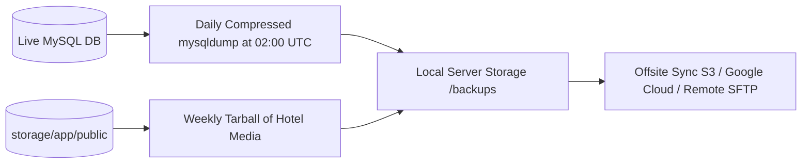

# Backup Strategy & Disaster Recovery Manual

## 1. Resilience Philosophy
The platform must guarantee zero permanent data loss and rapid recovery in the event of hardware failures, host corruption, accidental deletions, or security incidents.

A production-grade backup strategy covers two distinct storage tiers:
1. **Relational Database Tier**: MySQL schema, tenant configurations, orders, and audit logs.
2. **File Storage Tier**: Hotel logos, room photography, menu banners, and generated assets in `storage/app/public`.

---

## 2. Backup Schedule & Retention Policy



| Asset | Frequency | Retention Window | Storage Target |
| :--- | :--- | :--- | :--- |
| **MySQL Database** | Daily (02:00 UTC) | 30 Days Daily + 12 Months Monthly | Local `/backups` + Remote Offsite |
| **Media Assets** | Weekly (Sunday 03:00 UTC) | 90 Days Rolling | Local `/backups` + Remote Offsite |
| **System Environment** | On Change | Indefinite (Versioned) | Secure Password Vault (1Password / Bitwarden) |

---

## 3. Automated Backup Script for Hostinger Premium (`scripts/backup.sh`)

```bash
#!/bin/bash
# Hostinger Premium Automated Backup Script
set -e

BACKUP_DIR="/home/u123456789/backups"
TIMESTAMP=$(date +"%Y%m%d_%H%M%S")
PROJECT_DIR="/home/u123456789/domains/yourdomain.com/hotel-guest-platform"

mkdir -p "$BACKUP_DIR/db"
mkdir -p "$BACKUP_DIR/files"

# 1. Export MySQL Database
source "$PROJECT_DIR/.env"
mysqldump -h "$DB_HOST" -u "$DB_USERNAME" -p"$DB_PASSWORD" "$DB_DATABASE" | gzip > "$BACKUP_DIR/db/db_backup_${TIMESTAMP}.sql.gz"

# 2. Archive Hotel Media Storage
tar -czf "$BACKUP_DIR/files/media_backup_${TIMESTAMP}.tar.gz" -C "$PROJECT_DIR/storage/app" public

# 3. Prune Local Backups Older Than 30 Days
find "$BACKUP_DIR/db" -name "*.sql.gz" -mtime +30 -exec rm {} \;
find "$BACKUP_DIR/files" -name "*.tar.gz" -mtime +30 -exec rm {} \;

echo "Backup completed successfully at $(date)"
```

Add this script to Hostinger Scheduled Tasks / Cron:
`0 2 * * * /bin/bash /home/u123456789/scripts/backup.sh >> /home/u123456789/backups/backup.log 2>&1`

---

## 4. Disaster Recovery & Restoration Procedures

### Scenario A: Accidental Data Corruption or Schema Error
To restore the MySQL database to a known clean state:
```bash
# 1. Put application into maintenance mode
php artisan down --message="System maintenance in progress. Back shortly."

# 2. Decompress and restore MySQL dump
gunzip < /home/u123456789/backups/db/db_backup_20260930_020000.sql.gz | mysql -u u123456789_admin -p u123456789_hotel

# 3. Clear application caches
php artisan optimize:clear
php artisan config:cache
php artisan route:cache

# 4. Bring application back online
php artisan up
```

### Scenario B: Complete Server Rebuild
If the entire hosting environment must be re-provisioned:
1. Re-create the database in Hostinger hPanel.
2. Clone the Git repository.
3. Restore `.env` from secure backup vault.
4. Run `composer install --no-dev --optimize-autoloader`.
5. Restore database dump via MySQL CLI.
6. Extract media backup tarball into `storage/app/public`.
7. Run `php artisan storage:link`.
8. Verify `/health` endpoint.
