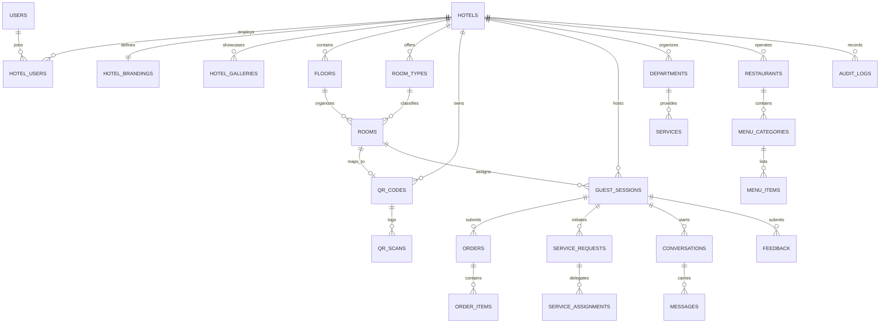

# Relational Database Schema & Data Dictionary

## 1. Overview
The platform uses a fully normalized relational schema designed for MySQL 8.x / MariaDB, enforcing strict foreign key constraints, composite query indexing, UTC timestamping, and soft-deletion where audit trails are required.

---

## 2. Entity-Relationship Diagram (ERD)

---

## 3. Core Tables & Indexing Strategy

### Multi-Tenancy & Platform Identity
- `hotels`: Primary tenant entity. Columns: `id`, `name`, `slug` (UNIQUE), `legal_name`, `email`, `phone`, `timezone`, `status`, `created_at`, `updated_at`.
- `hotel_brandings`: White-label presentation. Columns: `id`, `hotel_id` (UNIQUE FK), `primary_color`, `accent_color`, `welcome_message`, `logo_path`, `cover_path`.
- `hotel_users`: Tenant membership pivot. Columns: `id`, `hotel_id` (FK), `user_id` (FK), `is_owner`, `status`. Composite index: `(hotel_id, user_id)`.
- `users`: Staff and platform operators. Columns: `id`, `name`, `email` (UNIQUE), `password`, `is_active`, `is_platform_admin`, `remember_token`.

### Accommodations & Floor Plan
- `floors`: Physical building structure. Columns: `id`, `hotel_id` (FK), `number`, `name`, `sort_order`.
- `room_types`: Inventory classification. Columns: `id`, `hotel_id` (FK), `name`, `capacity`, `base_rate`, `description`.
- `rooms`: Physical guestrooms. Columns: `id`, `hotel_id` (FK), `floor_id` (FK, nullable), `room_type_id` (FK), `number`, `status` (`available`, `occupied`, `maintenance`, `cleaning`), `is_active`.
  - Composite Indexes: `(hotel_id, status)`, `(hotel_id, number)`.

### Permanent QR Code Engine
- `qr_codes`: Immutable public QR anchors.
  - Columns: `id`, `hotel_id` (FK), `public_token` (VARCHAR(48) UNIQUE), `qrable_type`, `qrable_id`, `label`, `is_active`, `last_scanned_at`.
  - Unique Index: `(public_token)`.
  - Polymorphic Index: `(qrable_type, qrable_id)`.
- `qr_scans`: Privacy-preserving scan analytics.
  - Columns: `id`, `hotel_id` (FK), `qr_code_id` (FK), `room_id` (FK, nullable), `anonymous_session_id`, `user_agent`, `referrer`, `ip_hash` (VARCHAR(64)), `scanned_at`.
  - Composite Index: `(hotel_id, scanned_at)`.

### Ephemeral Guest Sessions
- `guest_sessions`: QR-activated guest authorization context.
  - Columns: `id`, `hotel_id` (FK), `room_id` (FK, nullable), `qr_code_id` (FK), `public_id` (VARCHAR(48) UNIQUE), `browser_session_hash` (VARCHAR(64), nullable), `expires_at`, `last_seen_at`, `status` (`active`, `expired`, `checked_out`).
  - Unique Index: `(public_id)`.
  - Composite Index: `(hotel_id, status, expires_at)`.

### Service Routing & SLA Automation
- `departments`: Operational units (`Housekeeping`, `Maintenance`, `Front Desk`, `Concierge`, `Kitchen`).
- `services`: Catalog of guest services. Columns: `id`, `hotel_id` (FK), `department_id` (FK), `name`, `target_response_minutes`, `target_resolution_minutes`, `is_active`.
- `service_requests`: Active tickets.
  - Columns: `id`, `hotel_id` (FK), `guest_session_id` (FK), `room_id` (FK), `service_id` (FK), `department_id` (FK), `priority`, `status` (`PENDING`, `ACCEPTED`, `ASSIGNED`, `IN_PROGRESS`, `COMPLETED`, `ESCALATED`, `CANCELLED`), `response_due_at`, `resolution_due_at`, `completed_at`.
  - Composite Indexes: `(hotel_id, status)`, `(hotel_id, resolution_due_at)`.
- `service_request_status_histories`: Immutable transition history with user and reason logging.

### In-Room Dining & F&B
- `restaurants`: Outlets (`The Azure Grill & Lounge`, `Sky Bar`).
- `menu_categories`: Sections (`Appetizers`, `Mains`, `Beverages`).
- `menu_items`: Dish catalog. Columns: `id`, `hotel_id` (FK), `restaurant_id` (FK), `category_id` (FK), `name`, `price`, `tax_rate`, `preparation_minutes`, `is_available`, `dietary_flags` (JSON).
- `orders`: Dining orders.
  - Columns: `id`, `hotel_id` (FK), `guest_session_id` (FK), `room_id` (FK), `restaurant_id` (FK), `subtotal`, `tax`, `total`, `status` (`PENDING`, `ACCEPTED`, `PREPARING`, `READY`, `DELIVERED`, `CANCELLED`), `idempotency_key` (VARCHAR(64) UNIQUE).
  - Composite Index: `(hotel_id, status, created_at)`.
- `order_items`: Snapshotted line items. Columns: `id`, `order_id` (FK), `menu_item_id` (FK), `item_name`, `unit_price`, `quantity`, `subtotal`.

### Guest Compendium & Interactive Services
- `facilities`: Compendium amenities (`Infinity Rooftop Pool`, `Vitality Spa`, `24h Fitness Center`).
- `hotel_policies`: Stay rules (`Check-in/out hours`, `Pet policy`, `Smoking guidelines`).
- `offers`: Revenue-generating packages (`Couples Spa Retreat`, `Sunset Wine Tasting`).
- `local_recommendations`: Curated concierge spots (`Historic Old Town`, `Seaside Promenade`).
- `announcements`: Urgent broadcasts (`Pool maintenance on Tuesday`, `Breakfast terrace relocated`).
- `conversations` & `messages`: Bi-directional guest-to-reception chat.
- `feedback`: Post-service rating (`Great`, `Okay`, `Needs Attention`) with follow-up comment.

### Security & Compliance
- `audit_logs`: Administrative actions. Columns: `id`, `hotel_id` (FK, nullable), `user_id` (FK, nullable), `action`, `entity_type`, `entity_id`, `old_values` (JSON), `new_values` (JSON), `ip_address`, `created_at`.
