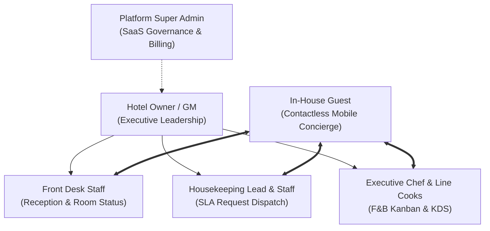
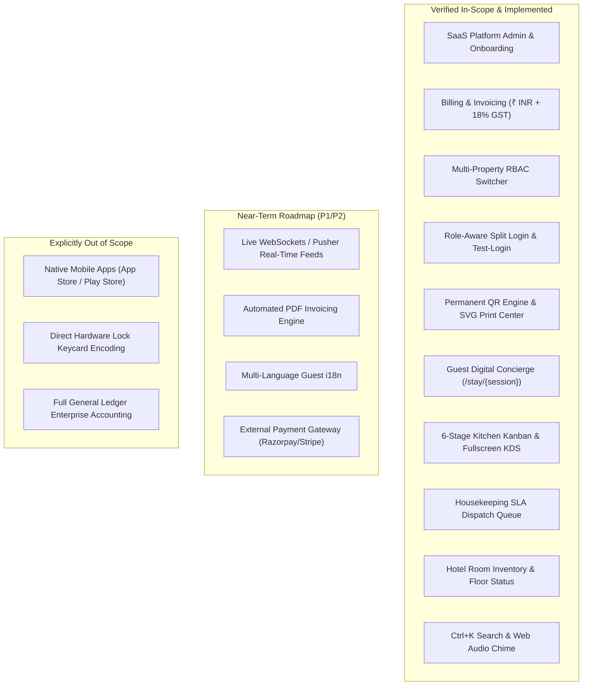
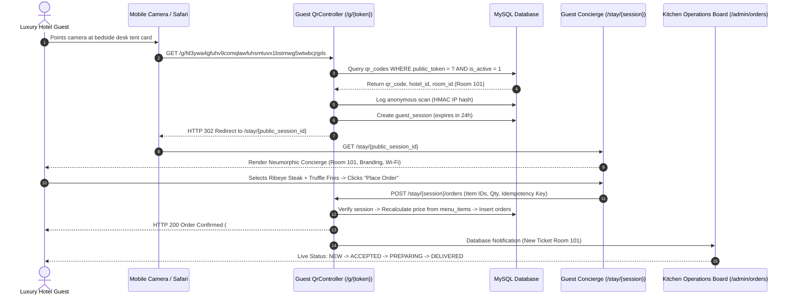
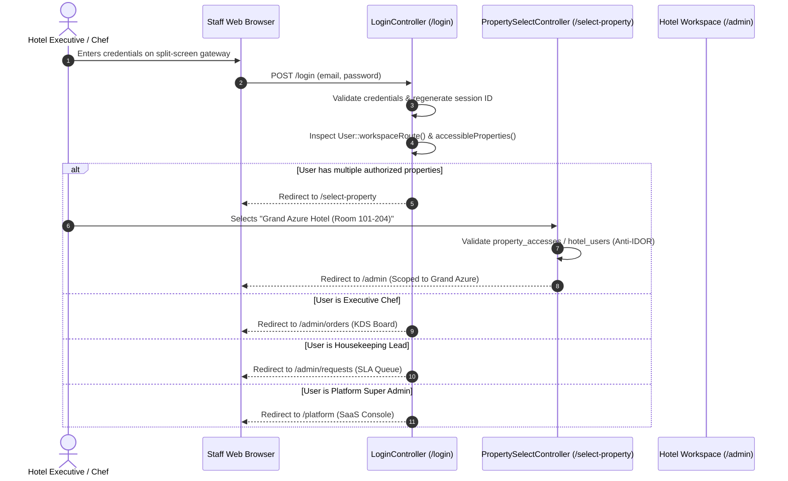
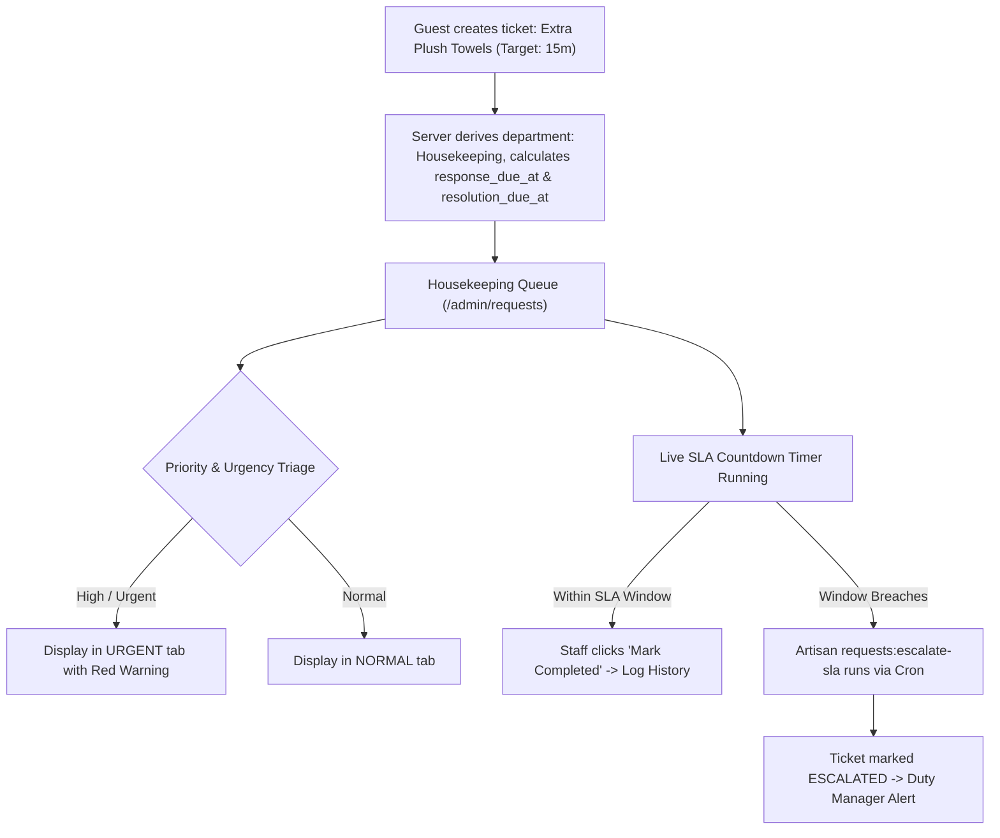
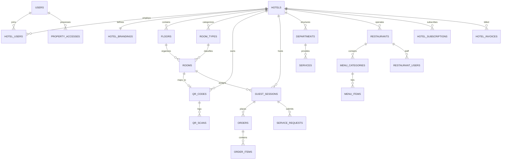
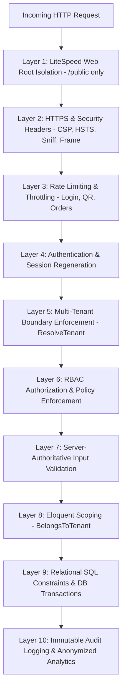
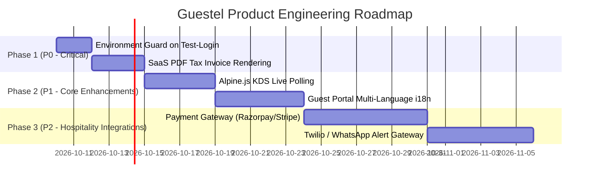

# Product Requirements Document (PRD)

# Guestel — Cloud Hospitality Operating System

**Document Version**: 1.0.0-PROD  
**Document Status**: Official / Approved  
**Last Updated**: October 2026  
**Product**: Guestel (Hotel Guest Platform)  
**Repository**: `Mrinmoypatratint/guestel`  
**Primary Tech Stack**: Laravel 13, PHP 8.4, Blade, Tailwind CSS 4, Alpine.js, Vite, MySQL 8 / SQLite  
**Audience**: Executive Leadership, Product Managers, Software Architects, Full-Stack Engineers, QA Leads, Hospitality Operations Specialists  

---

## Table of Contents
1. [Document Information](#1-document-information)
2. [Executive Summary](#2-executive-summary)
3. [Problem Statement](#3-problem-statement)
4. [Product Vision and Objectives](#4-product-vision-and-objectives)
5. [Target Users and Personas](#5-target-users-and-personas)
6. [Scope](#6-scope)
7. [Product Modules](#7-product-modules)
8. [Functional Requirements](#8-functional-requirements)
9. [User Stories](#9-user-stories)
10. [User Journeys and Workflows](#10-user-journeys-and-workflows)
11. [Roles and Permission Matrix](#11-roles-and-permission-matrix)
12. [UI/UX Requirements & Neumorphic Design System](#12-uiux-requirements--neumorphic-design-system)
13. [Data Requirements & Relational Data Dictionary](#13-data-requirements--relational-data-dictionary)
14. [API and Integration Requirements](#14-api-and-integration-requirements)
15. [Non-Functional Requirements](#15-non-functional-requirements)
16. [Security and Risk Management](#16-security-and-risk-management)
17. [Analytics and Success Metrics](#17-analytics-and-success-metrics)
18. [Testing and Quality Assurance](#18-testing-and-quality-assurance)
19. [Dependencies and Constraints](#19-dependencies-and-constraints)
20. [Current Implementation Assessment](#20-current-implementation-assessment)
21. [Prioritized Product Roadmap](#21-prioritized-product-roadmap)
22. [Open Questions and Assumptions](#22-open-questions-and-assumptions)
23. [Glossary](#23-glossary)
24. [Traceability Matrix](#24-traceability-matrix)

---

## 1. Document Information

| Field | Detail |
| :--- | :--- |
| **Product Name** | Guestel — Cloud Hospitality Operating System |
| **Document ID** | PRD-GUESTEL-2026-V1 |
| **Version** | 1.0.0-PROD |
| **Status** | Production-Ready Baseline |
| **Release Target** | General Availability (GA) |
| **Author** | Senior Product Manager, Software Architect & QA Specialist |
| **Primary Framework** | Laravel 13.17 on PHP 8.4 |
| **Database** | MySQL 8.x (Production) / SQLite 3 (Testing & Local Dev) |
| **Styling & Assets** | Tailwind CSS 4.0, Vite 8.3, Dark Neumorphic Soft UI |
| **Purpose** | Single authoritative specification for functional capabilities, business logic, authorization boundaries, technical architecture, and verification criteria. |

---

## 2. Executive Summary

### 2.1 Product Overview
**Guestel** is a multi-tenant, cloud-based Hospitality Operating System designed to bridge the gap between luxury guest interaction and high-velocity hotel operational execution. The platform replaces fragmented, paper-based hotel compendiums, cumbersome native mobile app downloads, and disjointed departmental communications with a unified digital ecosystem.

### 2.2 Business Context
Modern boutique hotels, luxury resorts, and upscale dining establishments face increasing guest expectations for instantaneous, contactless mobile self-service. Concurrently, operational staff (front desk, housekeeping, culinary teams, maintenance) struggle with disjointed legacy property management systems (PMS) that lack real-time SLA tracking, automated ticket routing, and actionable kitchen dispatching.

### 2.3 Core Value Proposition
1. **For Guests**: Zero-install, frictionless luxury. Guests scan an immutable, room-specific QR code to access room compendiums, dining menus, service requests, and reception chat with instant room binding.
2. **For Departmental Staff**: Specialized, low-fatigue Neumorphic workspaces. Housekeepers manage categorized SLA queues; chefs manage an interactive 6-stage Kanban and fullscreen Kitchen Display System (KDS); front-desk staff view live room inventories and occupancy.
3. **For Multi-Property Operators**: Role-aware property switching. General managers and restaurant group directors switch between venues without repeated logins or cross-tenant data leaks.
4. **For Platform SaaS Owners**: Complete multi-tenant commercial engine. Super Admins onboard hotels, issue automated INR invoices with 18% GST calculation, track payments, and broadcast system communications.

---

## 3. Problem Statement

### 3.1 Current Problems & Operational Inefficiencies
1. **The Native App Barrier**: Forcing hotel guests to download native iOS/Android apps or register usernames/passwords results in an industry-wide adoption rate under 12%. Guests abandon the experience and call the front desk for basic questions (Wi-Fi password, pool hours, late checkout).
2. **Paper Compendium Obsolescence**: Printed in-room directories become outdated whenever hours change, menu prices adjust, or amenities undergo maintenance. Re-printing physical directories across hundreds of rooms is costly and environmentally wasteful.
3. **Unmeasured Service SLAs**: Housekeeping and engineering requests logged via phone calls lack timestamps, automated dispatch, and SLA breach warnings. Urgent requests (extra pillows, AC malfunctions) are forgotten, leading to negative online reviews.
4. **Kitchen Order Bottlenecks**: In-room dining orders placed via telephone lead to inaccurate billing, lost dietary customization notes, double ordering on spotty phone lines, and lack of preparation tracking.
5. **Multi-Property Friction**: Hotel chains and multi-unit hospitality groups must manage separate accounts or systems for their dining venues and hotel rooms, creating administrative silos.

---

## 4. Product Vision and Objectives

### 4.1 Product Vision
To deliver the hospitality industry's most frictionless, visually refined, and operationally reliable cloud platform—where every touchpoint from bedside QR scan to kitchen pan is synchronized in real time under zero-trust multi-tenant security.

### 4.2 Strategic Objectives
- **Zero-Friction Guest Adoption**: Achieve >70% guest self-service engagement via camera QR scan without app downloads.
- **SLA Discipline**: Reduce average in-room service request resolution times by 35% through color-coded timers and automated escalation.
- **Revenue Acceleration**: Increase average in-room dining spend by 25% through visual menus, dietary tags, and streamlined ordering.
- **Operational Clarity**: Provide hotel and platform leadership with real-time operational metrics, audit trails, and financial visibility.

### 4.3 Key Performance Indicators (KPIs)
- **Guest Portal Time-to-Interaction**: < 1.2 seconds from QR scan to rendered room compendium.
- **Order Idempotency Integrity**: 100% duplicate submission rejection rate on spotty networks.
- **Cross-Tenant Data Leakage**: 0 incidents (strictly enforced via global Eloquent scopes and route gates).
- **Service Request SLA Compliance**: > 92% of tickets resolved within catalog target resolution windows.

---

## 5. Target Users and Personas



### 5.1 Persona Profiles

#### 1. Company Super Admin (`PLATFORM_ADMIN`)
- **Profile**: SaaS platform operator managing infrastructure, tenant subscriptions, and customer success.
- **Responsibilities**: Provisions new hotel tenants, manages monthly/annual subscription plans, issues GST tax invoices, logs subscription payments, broadcasts platform notices.
- **Pain Points**: Manual invoicing, lack of multi-tenant KPI visibility, difficult cross-property management.
- **Primary Interface**: Platform Console (`/platform`).

#### 2. Hotel General Manager / Property Owner (`HOTEL_ADMIN`, `HOTEL_OWNER`)
- **Profile**: General Manager or executive managing one or more hotel properties.
- **Responsibilities**: Oversees daily room occupancy, department response times, dining revenue, guest sentiment, staff permissions, and room QR generation.
- **Pain Points**: Disjointed departmental reports, blind spots in guest dissatisfaction before checkout, complex multi-property switching.
- **Primary Interface**: Admin Command Center (`/admin`), Property Switcher (`/select-property`).

#### 3. Housekeeping Lead (`HOUSEKEEPING_LEAD`, `HOUSEKEEPING`)
- **Profile**: Floor supervisor managing room cleaning schedules, linen distribution, and amenity fulfillment.
- **Responsibilities**: Triages incoming guest service requests, filters by urgency (`URGENT`, `HIGH`, `NORMAL`), delegates tasks to room attendants, monitors countdown timers to avoid SLA breaches.
- **Pain Points**: Constant radio chatter, lost paper tickets, inability to prioritize requests based on guest check-in status.
- **Primary Interface**: Dedicated Housekeeping Dispatch Queue (`/admin/requests`).

#### 4. Executive Chef / F&B Manager (`EXECUTIVE_CHEF`, `KITCHEN`)
- **Profile**: Head chef overseeing kitchen operations, preparation times, and menu availability.
- **Responsibilities**: Monitors live orders across 6 Kanban stages (`NEW` → `ACCEPTED` → `PREPARING` → `READY` → `DELIVERED`), operates fullscreen KDS, toggles menu item 86/out-of-stock availability, applies kitchen rush delays (+15 min).
- **Pain Points**: Paper tickets getting lost or smeared, lack of delivery tracking, unreadable handwriting on telephone orders.
- **Primary Interface**: Kitchen Operations Board & KDS (`/admin/orders`), Menu Editor (`/admin/restaurant`).

#### 5. Front Desk & Concierge Staff (`FRONT_DESK`, `CONCIERGE`)
- **Profile**: Reception team handling check-ins, room inventory changes, airport transfers, and guest messaging.
- **Responsibilities**: Updates room statuses (`available`, `occupied`, `cleaning`, `maintenance`), responds to guest chat inquiries, generates QR tent cards.
- **Pain Points**: Overloaded phone lines, manual paper lookups, missing guest records.
- **Primary Interface**: Rooms Directory (`/admin/rooms`), Chat Console (`/admin/chat`), Search Bar (`Ctrl+K`).

#### 6. Luxury Hotel Guest (`GUEST`)
- **Profile**: Business or leisure traveler staying in a specific guestroom.
- **Responsibilities**: Experiences the hotel, requests amenities, orders food, reads policies, provides stay feedback.
- **Pain Points**: Unwillingness to download apps or enter credentials, frustration with slow phone response times, lack of clear menu descriptions.
- **Primary Interface**: Contactless Mobile Concierge (`/g/{token}` → `/stay/{session}`).

---

## 6. Scope



### 6.1 Verified and Implemented Scope
- Multi-tenant data isolation via Eloquent global scopes and middleware (`ResolveTenant`, `BelongsToTenant`).
- Platform SaaS governance: Hotel onboarding, subscription tracking, tax invoicing in INR with 18% GST, platform broadcasts.
- Role-aware split login screen with 4 personas and local test-login bypass.
- Multi-property access control (`property_accesses`, `restaurant_users`, `/select-property`, `/switch-property`).
- Cryptographic 48-character opaque QR token engine with vector SVG generator and A4 commercial print sheet.
- Mobile web guest portal with room compendium, amenities, Wi-Fi card, policy guide, curated local guides, and 3-tap service feedback.
- Server-authoritative in-room dining orders with client price rejection and idempotency protection.
- 6-stage Kitchen Kanban board with fullscreen high-contrast Kitchen Display Mode (KDS).
- Housekeeping operations board with SLA countdowns, priority tabs, and automated escalation.
- Room inventory with quick status updating (`available`, `occupied`, `cleaning`, `maintenance`).
- Web Audio API two-tone chime and `Ctrl+K` operational search bar.
- Fully automated test suite with **25 feature/unit tests and 103 assertions**.

### 6.2 Out-of-Scope Features
- Proprietary hardware door-lock Bluetooth/NFC key encoding.
- Native mobile binary distribution (iOS App Store / Google Play Store) — web-first PWA is the intentional design.
- Complete double-entry general ledger corporate accounting.

### 6.3 Future Opportunities
- Direct PMS integration (Oracle Hospitality Opera Cloud, Mews, Cloudbeds API).
- AI Concierge assistant backed by LLM trained on hotel compendiums.
- WhatsApp Business API integration for guest messaging.

---

## 7. Product Modules

### Module 1: SaaS Platform Governance & Commercial Invoicing
- **Purpose**: Provides the platform operator with global oversight across all tenant hotels, subscriptions, billing cycles, and system-wide communications.
- **Target Users**: Company Super Admin (`PLATFORM_ADMIN`).
- **Features**:
  - Live SaaS KPI cards: Total registered properties, active subscriptions, monthly recurring revenue (MRR) in INR (`₹`), paid vs unpaid invoice tracking.
  - Hotel onboarding workflow with automatic default subscription generation (`Professional Cloud`, ₹9,999/mo default).
  - Tax invoice generation with unique sequential invoice numbers (e.g., `INV-202610-001`), line-item subtotal, 18% GST computation, and due date tracking.
  - Manual payment recording with reference ID, payment method (`Bank Transfer`, `UPI`, `Card`), and status update (`unpaid` → `paid`).
  - Network-wide broadcast communications with audience scoping (`hotel_admin`, `restaurant_staff`, `all`).
- **Permissions**: `platform.manage` / `is_platform_admin = true`.
- **Implementation Status**: **Implemented** (`App\Http\Controllers\Platform\*`, verified by `PlatformSaasOperationsTest`).

### Module 2: Identity, Role Gateway & Multi-Property Switcher
- **Purpose**: Authenticates staff members, enforces tenant membership, and enables users with multiple property assignments to seamlessly navigate their authorized portfolio.
- **Target Users**: All internal staff (Super Admin, GMs, Housekeeping Leads, Chefs).
- **Features**:
  - Split-screen Dark Neumorphic login gateway with 4 interactive role cards.
  - Server-authoritative session regeneration upon login.
  - Intelligent post-login redirection based on `User::workspaceRoute()`:
    - Super Admin → `/platform`
    - Multi-property users → `/select-property`
    - Single-property Housekeeping → `/admin/requests`
    - Single-property Chefs → `/admin/orders`
    - Single-property GMs → `/admin`
  - Role-filtered property selector: Chefs only see restaurants; housekeepers only see hotels with room queues; executives see authorized property networks.
  - Secure tenant switching route (`/switch-property`) with server-side IDOR prevention returning `403 Forbidden` on unauthorized attempts.
- **Permissions**: Public access to login; authenticated access to property switcher.
- **Implementation Status**: **Implemented** (`App\Http\Controllers\Auth\LoginController`, `PropertySelectController`, verified by `LandingAndRoleBasedAuthTest`).

### Module 3: Contactless Permanent QR Engine & Print Center
- **Purpose**: Generates immutable, tamper-resistant QR capability tokens and high-resolution commercial print layouts.
- **Target Users**: Hotel Admin, Front Desk Staff, Printing Vendors.
- **Features**:
  - Generation of 48-character cryptographic lowercase alphanumeric tokens (`Str::lower(Str::random(48))`).
  - Separation of QR code physical asset from operational metadata (renaming room or changing floor requires zero re-printing).
  - Native server-side vector SVG rendering via `chillerlan/php-qrcode` (zero third-party API dependencies).
  - Privacy-preserving scan telemetry storing HMAC-SHA256 hashed client IP addresses.
  - Printable A4 tent-card layout (`/admin/qr-center/print`) with cut guidelines, folding creases, room numbers, and clear guest scanning instructions.
- **Permissions**: `qr.manage`.
- **Implementation Status**: **Implemented** (`App\Http\Controllers\Admin\QrCenterController`, `QrController`, verified by `QrCenterTest`, `QrSecurityTest`).

### Module 4: Luxury Guest Digital Concierge
- **Purpose**: Delivers a zero-install, responsive web application for in-house guests to access compendium information, hotel amenities, and services.
- **Target Users**: In-House Guests.
- **Features**:
  - Frictionless access: Resolves `/g/{token}` into `/stay/{session}` with automated 24-hour guest session creation.
  - Room compendium: Dynamic hotel branding, welcome greeting, room number badge.
  - Interactive Wi-Fi card with one-click clipboard copy of SSID and password.
  - Amenities and facilities directory (pool, spa, gym hours and locations).
  - Curated local recommendations and policy guides.
  - Direct service request dispatch (Housekeeping, Engineering, Front Desk).
  - 3-tap service feedback widget (`Great`, `Okay`, `Needs Attention`) with follow-up comment logging.
- **Permissions**: Public access governed by valid, non-expired `guest_session` token.
- **Implementation Status**: **Implemented** (`App\Http\Controllers\Guest\StayController`, `resources/views/guest/home.blade.php`, verified by `GuestPortalCompendiumTest`).

### Module 5: In-Room Dining & Kitchen Display System (KDS)
- **Purpose**: Powers visual digital menus for guests and an interactive, high-contrast operational dispatch board for culinary teams.
- **Target Users**: Guests, Executive Chefs, Line Cooks, Restaurant Managers.
- **Features**:
  - Digital menu display with high-resolution food imagery, prices, tax breakdowns, and dietary tags (`vegetarian`, `vegan`, `gluten-free`).
  - Idempotent guest cart submission rejecting client-provided prices and taxes (server computes totals strictly from database rows).
  - 6-stage Kitchen Kanban board: `NEW` → `ACCEPTED` → `PREPARING` → `READY` → `DELIVERED` → `CANCELLED`.
  - Fullscreen high-contrast **Kitchen Display Mode (KDS)** optimized for tablets and kitchen display screens.
  - Kitchen status controls: Toggle restaurant operational status (`OPEN`, `PAUSED`, `CLOSED`) and apply `+15 min Rush Delay`.
  - Menu item availability toggle (instantly 86/mark out of stock).
- **Permissions**: Guests order via session; staff manage orders via `orders.view`, `orders.update`, `menu.manage`.
- **Implementation Status**: **Implemented** (`App\Http\Controllers\Admin\OrderController`, `RestaurantController`, verified by `OrderSecurityTest`).

### Module 6: Housekeeping & Service SLA Dispatch
- **Purpose**: Manages departmental task assignment, SLA countdown tracking, and priority ticket resolution.
- **Target Users**: Housekeeping Lead, Room Attendants, Facilities Engineers, Front Desk.
- **Features**:
  - Categorized urgency tabs: `URGENT`, `HIGH`, `NORMAL`, `COMPLETED`.
  - Target response and resolution timestamps automatically calculated from service catalog metadata upon ticket creation.
  - Live color-coded SLA countdown timer with dynamic badge alerts for breached tickets.
  - One-click status progression: `PENDING` → `ASSIGNED` → `IN_PROGRESS` → `COMPLETED`.
  - Task categorization for linens, towels, luxury toiletries, room cleaning, and maintenance repairs.
  - Immutable status change audit history recorded in `service_request_status_histories`.
- **Permissions**: `requests.view`, `requests.update`, `requests.assign`.
- **Implementation Status**: **Implemented** (`App\Http\Controllers\Admin\ServiceRequestController`, verified by `ServiceRoutingTest`).

### Module 7: Accommodations & Floor Inventory Management
- **Purpose**: Gives reception and operations staff a live, visual floor plan and room management tool.
- **Target Users**: Front Desk Staff, Hotel Operations Managers.
- **Features**:
  - Real-time room status grid categorized by `available`, `occupied`, `cleaning`, and `maintenance`.
  - Room detail view displaying room type, current occupant status, assigned QR code, scan telemetry, and active service tabs.
  - One-click status updating with instant UI state refresh.
  - Room creation and floor association.
- **Permissions**: `rooms.view`, `rooms.create`, `rooms.update`.
- **Implementation Status**: **Implemented** (`App\Http\Controllers\Admin\RoomController`, verified by `TenantIsolationTest`).

### Module 8: Executive Command Center, Telemetry & Audit
- **Purpose**: Consolidates live operational telemetry into an executive dispatch dashboard with instant search and alert mechanisms.
- **Target Users**: General Managers, Duty Managers, Operations Supervisors.
- **Features**:
  - 6 Executive KPI cards: Gross Dining Revenue, Occupancy Ratio, Active Service Requests, Kitchen Ticket Count, Guest Satisfaction %, SLA Breach Count.
  - Live Operations Queue combining pending food orders and service tickets with elapsed time indicators.
  - Synthesized Web Audio API two-tone chime (587 Hz → 880 Hz) alerting staff to incoming tickets.
  - Asynchronous `Ctrl+K` Global Command Bar searching across room numbers, ticket IDs, guest requests, and menu items with strict tenant scoping.
  - Immutable audit logs capturing administrative actions, timestamps, and IP addresses.
- **Permissions**: `hotel.view`, `analytics.view`, `audit.view`.
- **Implementation Status**: **Implemented** (`App\Http\Controllers\Admin\DashboardController`, `SearchController`, `AnalyticsController`, verified by `SearchSecurityTest`).

---

## 8. Functional Requirements

### 8.1 SaaS Platform Governance & Billing (`FR-PLAT`)
| ID | Requirement Name | Description | Responsible | Preconditions | Expected Behavior | Priority | Status |
| :--- | :--- | :--- | :--- | :--- | :--- | :---: | :---: |
| **FR-PLAT-001** | Platform Admin Authentication | Enforce global Super Admin access control on platform routes. | System / Auth | User logged in. | If `is_platform_admin = true`, allow access; else abort with `HTTP 403 Forbidden`. | P0 | Implemented |
| **FR-PLAT-002** | Multi-Tenant Hotel Provisioning | Create a new hotel tenant, default branding, owner credentials, and subscription. | Platform Admin | Valid payload (`name`, `city`, `email`). | In a single database transaction, insert `hotels`, `hotel_brandings`, `users`, `hotel_users`, and `hotel_subscriptions`. | P0 | Implemented |
| **FR-PLAT-003** | Automated Subscription Generation | Automatically attach a subscription plan upon hotel onboarding. | System | Hotel created. | Insert `hotel_subscriptions` record with `fee = 9999.00`, `currency = 'INR'`, `status = 'active'`, and `renews_at = +30 days`. | P0 | Implemented |
| **FR-PLAT-004** | GST Invoicing Generation | Issue a tax invoice with calculated 18% GST in Indian Rupees. | Platform Admin | Hotel exists. | Generate unique invoice number (`INV-YYYYMM-XXX`), calculate `tax_amount = subtotal * 0.18`, `total_amount = subtotal + tax_amount`, set status to `unpaid`. | P0 | Implemented |
| **FR-PLAT-005** | Invoicing Payment Recording | Log offline or electronic payment for an outstanding invoice. | Platform Admin | Invoice is `unpaid`. | Update invoice status to `paid`, log `paid_at = now()`, record `payment_method` and `payment_reference`. | P1 | Implemented |
| **FR-PLAT-006** | Platform Broadcast Communication | Send targeted announcement message to hotel leadership or dining staff. | Platform Admin | Admin authenticated. | Create `platform_communications` row with specified `target_audience`, `subject`, and `message`. | P1 | Implemented |

### 8.2 Identity, RBAC & Multi-Property Switching (`FR-AUTH`)
| ID | Requirement Name | Description | Responsible | Preconditions | Expected Behavior | Priority | Status |
| :--- | :--- | :--- | :--- | :--- | :--- | :---: | :---: |
| **FR-AUTH-001** | Session Regeneration on Login | Mitigate session fixation by issuing a new session ID upon successful credential validation. | System / Auth | Valid login credentials. | Regenerate session ID and re-issue CSRF token; destroy old session. | P0 | Implemented |
| **FR-AUTH-002** | Role-Aware Post-Login Redirection | Route authenticated staff to their designated operational workspace. | System | User authenticated. | Check `User::workspaceRoute()`: Super Admin to `/platform`, multi-property to `/select-property`, Housekeeping to `/admin/requests`, Chefs to `/admin/orders`, GM to `/admin`. | P0 | Implemented |
| **FR-AUTH-003** | Multi-Property Access Enforcement | Verify user authorization before switching active tenant context. | System / Middleware | User authenticated. | Check `property_accesses` or `hotel_users`/`restaurant_users`. If authorized, update session active property; if unauthorized, abort `HTTP 403`. | P0 | Implemented |
| **FR-AUTH-004** | Role-Filtered Property Selector | Filter available venues on `/select-property` by role capability. | System | User on `/select-property`. | Chefs only see dining venues with order queues; Housekeepers only see hotels with room queues; Admins see authorized hotel networks. | P1 | Implemented |
| **FR-AUTH-005** | One-Click Test Login Authentication | Facilitate automated testing and local developer verification across all 4 personas. | Developer / Test | Dev/Test environment. | Directly authenticate user by selected role key without manual password typing. Must be blocked in production. | P1 | Implemented |

### 8.3 Permanent QR Engine & Print Center (`FR-QR`)
| ID | Requirement Name | Description | Responsible | Preconditions | Expected Behavior | Priority | Status |
| :--- | :--- | :--- | :--- | :--- | :--- | :---: | :---: |
| **FR-QR-001** | Cryptographic Token Generation | Generate non-sequential, opaque 48-character capability tokens. | System | Room created. | Generate `Str::lower(Str::random(48))` and insert into `qr_codes.public_token` with unique index. | P0 | Implemented |
| **FR-QR-002** | QR Code Resolution & Redirection | Resolve public token to current room context and initialize guest session. | Guest / System | User scans QR URL `/g/{token}`. | If token valid and active, record HMAC IP scan and redirect `302` to `/stay/{session_public_id}`; if invalid, return clean `404 Not Found`. | P0 | Implemented |
| **FR-QR-003** | Server-Side Vector SVG Output | Render pure SVG XML string for a QR token without external APIs. | System | Staff views QR. | Stream pure vector SVG formatted with high error correction and correct aspect ratio. | P1 | Implemented |
| **FR-QR-004** | Batch A4 Commercial Print Sheet | Render printable tent-card layout formatted for standard A4 paper. | Staff / Admin | Staff visits `/admin/qr-center/print`. | Display multi-card grid with cut guidelines, folding lines, hotel branding, room numbers, and guest instructions. | P1 | Implemented |

### 8.4 Guest Digital Concierge (`FR-GUEST`)
| ID | Requirement Name | Description | Responsible | Preconditions | Expected Behavior | Priority | Status |
| :--- | :--- | :--- | :--- | :--- | :--- | :---: | :---: |
| **FR-GUEST-001** | Room-Bound Compendium Presentation | Render personalized hotel directory bound to the guest's physical room. | System | Valid `guest_session`. | Display hotel branding, primary colors, room number, Wi-Fi password copy button, policies, and facilities. | P0 | Implemented |
| **FR-GUEST-002** | Service Request Submission | Enable guest to request amenities or maintenance with automated SLA derivation. | Guest | Guest on portal. | Submit `service_id` and optional notes; server derives department and target SLA timestamps from service catalog. | P0 | Implemented |
| **FR-GUEST-003** | 3-Tap Service Feedback Loop | Collect instant in-stay sentiment ratings from guests. | Guest | Service completed. | Display `Great`, `Okay`, `Needs Attention` options; store selection and optional feedback text in `feedback` table. | P1 | Implemented |
| **FR-GUEST-004** | Concierge Chat Messaging | Allow guest to submit direct text inquiries to hotel reception. | Guest | Valid session. | Insert message row linked to active conversation and dispatch notification to front desk. | P2 | Implemented |

### 8.5 In-Room Dining & Kitchen Display System (`FR-ORD`)
| ID | Requirement Name | Description | Responsible | Preconditions | Expected Behavior | Priority | Status |
| :--- | :--- | :--- | :--- | :--- | :--- | :---: | :---: |
| **FR-ORD-001** | Server-Authoritative Price Calculation | Calculate order subtotals, taxes, and totals exclusively from database records. | System | Guest submits cart. | Reject any client-provided price, tax, or discount values; query `menu_items` table for authoritative unit prices. | P0 | Implemented |
| **FR-ORD-002** | Order Idempotency Enforcement | Prevent duplicate order creation on unstable mobile connections. | System | Guest submits order. | Check `idempotency_key` (UUID); if duplicate key detected within 24h, return existing order record without double-charging. | P0 | Implemented |
| **FR-ORD-003** | 6-Stage Kitchen Kanban Workflow | Advance dining orders through sequential culinary stages. | Kitchen Staff | Order in queue. | Allow transitions: `NEW` → `ACCEPTED` → `PREPARING` → `READY` → `DELIVERED` (or `CANCELLED`). | P0 | Implemented |
| **FR-ORD-004** | Fullscreen High-Contrast KDS Mode | Provide a dedicated, high-visibility interface for kitchen tablet displays. | Line Cook | Staff on orders page. | Render high-contrast ticket layout with item counts, special instructions, elapsed prep timer, and touch-target action buttons. | P1 | Implemented |
| **FR-ORD-005** | Kitchen Operational Status Controls | Control kitchen accepting status and communicate rush delays. | Executive Chef | Chef on orders board. | Toggle kitchen status (`OPEN`, `PAUSED`, `CLOSED`) and apply `+15 min Rush Delay` banner to guest menus. | P1 | Implemented |

### 8.6 Housekeeping & Operations SLA Management (`FR-HK`)
| ID | Requirement Name | Description | Responsible | Preconditions | Expected Behavior | Priority | Status |
| :--- | :--- | :--- | :--- | :--- | :--- | :---: | :---: |
| **FR-HK-001** | Categorized Urgency Ticket Triage | Organize housekeeping requests into distinct urgency tabs. | Housekeeping Staff | Requests exist. | Display tabs: `URGENT`, `HIGH`, `NORMAL`, `COMPLETED` based on priority and elapsed SLA time. | P0 | Implemented |
| **FR-HK-002** | Live SLA Countdown & Breach Badging | Track remaining time before service ticket breaches target resolution window. | System / UI | Ticket active. | Compute `remaining_minutes = resolution_due_at - now()`. Display red badge and warning alert when breached (`remaining < 0`). | P0 | Implemented |
| **FR-HK-003** | Automated Ticket Escalation | Mark overdue tickets as ESCALATED via automated scheduler. | Scheduled Task | Overdue ticket exists. | Daily/hourly cron checks active tickets where `now() > resolution_due_at`; update status to `ESCALATED` and record history. | P1 | Implemented |

### 8.7 Accommodations & Floor Inventory (`FR-OPS`)
| ID | Requirement Name | Description | Responsible | Preconditions | Expected Behavior | Priority | Status |
| :--- | :--- | :--- | :--- | :--- | :--- | :---: | :---: |
| **FR-OPS-001** | Floor Plan Status Visualization | View room inventory organized by floor and cleaning status. | Front Desk / Staff | User authenticated. | Render room cards color-coded by status (`available`, `occupied`, `cleaning`, `maintenance`). | P0 | Implemented |
| **FR-OPS-002** | One-Click Room Status Switcher | Instantly update room cleaning or occupancy state. | Housekeeping / Desk | Valid room ID. | Update `rooms.status` to selected state; log action in audit trail; refresh inventory view. | P0 | Implemented |
| **FR-OPS-003** | Room QR Code Binding | Link physical room entity to permanent QR token. | System | Room created. | Automatically generate and bind a `qr_codes` record polymorphic to the newly created room. | P0 | Implemented |

### 8.8 Security, Multi-Tenancy & Search (`FR-SEC`)
| ID | Requirement Name | Description | Responsible | Preconditions | Expected Behavior | Priority | Status |
| :--- | :--- | :--- | :--- | :--- | :--- | :---: | :---: |
| **FR-SEC-001** | Eloquent Global Tenant Scoping | Automatically scope all tenant-owned queries to the active hotel tenant. | System / Eloquent | Staff authenticated. | `BelongsToTenant` trait appends `WHERE hotel_id = ?` to all `SELECT`, `UPDATE`, and `DELETE` queries. | P0 | Implemented |
| **FR-SEC-002** | Cross-Tenant IDOR Prevention | Prevent staff in Hotel A from accessing resources belonging to Hotel B. | System / Route Binding | Request sent. | Scoped route model binding triggers `HTTP 404 Not Found` if resource belongs to another tenant. | P0 | Implemented |
| **FR-SEC-003** | Scoped Ctrl+K Operations Search | Provide instant search strictly filtered to active tenant records. | Staff / SearchController | Authenticated staff. | Search rooms, tickets, orders, and menu items matching query string exclusively within active `hotel_id`. | P1 | Implemented |
| **FR-SEC-004** | Web Audio API Audio Alert | Synthesize harmonic chime on incoming tickets without media downloads. | Browser / Staff | Staff on dashboard. | Play two-tone Web Audio chime (587 Hz → 880 Hz) when new orders or service requests arrive in the queue. | P1 | Implemented |

---

## 9. User Stories

| Story ID | User Role | Action / Capability | Business Value | Priority | Dependencies | Status |
| :--- | :--- | :--- | :--- | :---: | :--- | :---: |
| **US-001** | Platform Super Admin | Onboard a new hotel tenant with name, city, owner email, and subscription plan | Rapidly monetize new hospitality clients with zero manual database scripting | P0 | `FR-PLAT-002`, `FR-PLAT-003` | Implemented |
| **US-002** | Platform Super Admin | Generate tax invoices with 18% GST and log offline payments in Indian Rupees | Maintain accurate commercial accounting and compliant tax billing | P0 | `FR-PLAT-004`, `FR-PLAT-005` | Implemented |
| **US-003** | Multi-Property GM | Switch between my authorized hotels and dining venues from a central selector | Manage my hospitality portfolio without logging out or juggling credentials | P0 | `FR-AUTH-003`, `FR-AUTH-004` | Implemented |
| **US-004** | Luxury Hotel Guest | Scan bedside QR code with my mobile phone to instantly see Wi-Fi and amenities | Enjoy effortless self-service without downloading apps or registering accounts | P0 | `FR-QR-002`, `FR-GUEST-001` | Implemented |
| **US-005** | Luxury Hotel Guest | Place an in-room dining order with dietary requests and real-time total breakdown | Order delicious food quickly with confidence that my order was received | P0 | `FR-ORD-001`, `FR-ORD-002` | Implemented |
| **US-006** | Executive Chef | View incoming food tickets in a high-contrast Kitchen Display Mode (KDS) | Keep line cooks synchronized and fulfill dishes within target preparation windows | P0 | `FR-ORD-003`, `FR-ORD-004` | Implemented |
| **US-007** | Housekeeping Lead | Triage room requests by urgency (`URGENT`, `HIGH`, `NORMAL`) with SLA countdowns | Resolve guest towel and linen requests before SLA deadlines breach | P0 | `FR-HK-001`, `FR-HK-002` | Implemented |
| **US-008** | Front Desk Receptionist | Search room numbers and guest ticket IDs using `Ctrl+K` keyboard shortcut | Answer guest phone inquiries in seconds without navigating multi-level menus | P1 | `FR-SEC-003` | Implemented |
| **US-009** | Hotel Operations GM | Print a batch of A4 desk tent cards with folding guidelines and QR codes | Outfit newly renovated rooms with luxury branded physical collateral | P1 | `FR-QR-004` | Implemented |
| **US-010** | In-House Guest | Submit 3-tap service feedback (`Great`, `Okay`, `Needs Attention`) during stay | Give immediate feedback so hotel management can resolve issues prior to checkout | P1 | `FR-GUEST-003` | Implemented |

---

## 10. User Journeys and Workflows

### 10.1 Journey 1: Guest Contactless QR Discovery & In-Room Dining



### 10.2 Journey 2: Multi-Property Executive & Role-Aware Gateway



### 10.3 Journey 3: Housekeeping SLA Dispatch & Escalation Workflow



---

## 11. Roles and Permission Matrix

The platform employs a fine-grained capability-based authorization model enforced by `App\Http\Middleware\EnsurePermission` and Laravel Eloquent Policies.

| Capability / Permission Key | Platform Super Admin | Property Owner | General Manager | Front Desk | Housekeeping Lead | Executive Chef | Facilities Engineer | Concierge |
| :--- | :---: | :---: | :---: | :---: | :---: | :---: | :---: | :---: |
| `platform.manage` | **ALLOW** | DENY | DENY | DENY | DENY | DENY | DENY | DENY |
| `hotel.view` | **ALLOW** | **ALLOW** | **ALLOW** | **ALLOW** | DENY | DENY | DENY | **ALLOW** |
| `hotel.update` | **ALLOW** | **ALLOW** | **ALLOW** | DENY | DENY | DENY | DENY | DENY |
| `rooms.view` | **ALLOW** | **ALLOW** | **ALLOW** | **ALLOW** | **ALLOW** | DENY | **ALLOW** | **ALLOW** |
| `rooms.create` | **ALLOW** | **ALLOW** | **ALLOW** | DENY | DENY | DENY | DENY | DENY |
| `rooms.update` | **ALLOW** | **ALLOW** | **ALLOW** | **ALLOW** | **ALLOW** | DENY | DENY | DENY |
| `qr.manage` | **ALLOW** | **ALLOW** | **ALLOW** | **ALLOW** | DENY | DENY | DENY | DENY |
| `requests.view` | **ALLOW** | **ALLOW** | **ALLOW** | **ALLOW** | **ALLOW** | DENY | **ALLOW** | **ALLOW** |
| `requests.assign` | **ALLOW** | **ALLOW** | **ALLOW** | **ALLOW** | **ALLOW** | DENY | DENY | DENY |
| `requests.update` | **ALLOW** | **ALLOW** | **ALLOW** | **ALLOW** | **ALLOW** | DENY | **ALLOW** | **ALLOW** |
| `orders.view` | **ALLOW** | **ALLOW** | **ALLOW** | **ALLOW** | DENY | **ALLOW** | DENY | DENY |
| `orders.update` | **ALLOW** | **ALLOW** | **ALLOW** | **ALLOW** | DENY | **ALLOW** | DENY | DENY |
| `menu.manage` | **ALLOW** | **ALLOW** | **ALLOW** | DENY | DENY | **ALLOW** | DENY | DENY |
| `staff.manage` | **ALLOW** | **ALLOW** | **ALLOW** | DENY | DENY | DENY | DENY | DENY |
| `analytics.view` | **ALLOW** | **ALLOW** | **ALLOW** | DENY | DENY | DENY | DENY | DENY |
| `audit.view` | **ALLOW** | **ALLOW** | **ALLOW** | DENY | DENY | DENY | DENY | DENY |

---

## 12. UI/UX Requirements & Neumorphic Design System

### 12.1 Design Philosophy: Dark Neumorphic Soft UI
The entire Guestel application (landing page, auth gateway, platform console, hotel admin, KDS board, and guest portal) is styled with a bespoke **Dark Neumorphic Soft UI** aesthetic. This eliminates harsh flat borders in favor of extruded, low-fatigue tactile surfaces.

### 12.2 Design Tokens & Styling Specifications
- **Base Background**: Deep Slate (`#0B1120`, `#0F172A`).
- **Elevated Surfaces**: Dark Neumorphic Container (`#1E293B` with layered convex dual shadows):
  - Highlight Shadow: `box-shadow: -4px -4px 10px rgba(255, 255, 255, 0.04)`
  - Ambient Shadow: `box-shadow: 6px 6px 14px rgba(0, 0, 0, 0.45)`
- **Inset / Pressed Surfaces**: Concave Inner Shadow for active tabs, input fields, and pressed states:
  - `box-shadow: inset 3px 3px 6px rgba(0, 0, 0, 0.5), inset -2px -2px 5px rgba(255, 255, 255, 0.03)`
- **Accent Palettes**:
  - **Hospitality Amber / Gold**: `#F59E0B` to `#D97706` (luxury branding, pending states, VIP indicators).
  - **Cyan / Sapphire**: `#06B6D4` to `#3B82F6` (active timers, KDS tickets, technology highlights).
  - **Emerald Green**: `#10B981` (ready for delivery, completed tickets, paid invoices).
  - **Crimson Red**: `#EF4444` (SLA breach warnings, cancelled orders, overdue debts).
- **Typography**: Clean, geometric sans-serif (Inter / System UI) with strict hierarchy:
  - Headers: Semi-bold / Bold with letter-spacing `-0.02em`.
  - Numbers / Currency: Tabular figures (`font-variant-numeric: tabular-nums`).
- **Micro-Animations & Feedback**:
  - Smooth transitions (`150ms ease-in-out`) on button presses and card hover states.
  - Web Audio API harmonic chime for non-intrusive auditory notification.
  - Zero jarring full-page layout shifts (CLS < 0.05).

---

## 13. Data Requirements & Relational Data Dictionary

The platform uses a fully normalized relational schema designed for MySQL 8.x / MariaDB and validated against SQLite 3.



### 13.1 Complete Table Inventory (All 10 Migrations)

| Migration Key | Table Name | Purpose & Primary Keys | Important Fields & Indexes |
| :--- | :--- | :--- | :--- |
| `0001_01_01_000000` | `users` | Staff and platform users. | `id`, `name`, `email` (UNIQUE), `password`, `is_platform_admin`, `is_active`. |
| `2026_09_30_000100` | `hotels` | Primary tenant organization. | `id`, `name`, `slug` (UNIQUE), `legal_name`, `email`, `phone`, `city`, `status`. |
| `2026_09_30_000100` | `hotel_brandings` | White-label UI attributes. | `id`, `hotel_id` (UNIQUE FK), `primary_color`, `accent_color`, `logo_path`, `cover_image_path`. |
| `2026_09_30_000100` | `roles` | RBAC role definitions. | `id`, `name` (UNIQUE), `label`, `description`. |
| `2026_09_30_000100` | `permissions` | Granular capability keys. | `id`, `name` (UNIQUE), `label`, `module`. |
| `2026_09_30_000100` | `hotel_users` | Tenant membership pivot. | `id`, `hotel_id` (FK), `user_id` (FK), `is_owner`, `status`. Composite Index `(hotel_id, user_id)`. |
| `2026_09_30_000100` | `user_roles` | Role assignment pivot. | `id`, `user_id` (FK), `role_id` (FK), `hotel_id` (FK, nullable). |
| `2026_09_30_000200` | `floors` | Physical building layout. | `id`, `hotel_id` (FK), `number`, `name`, `sort_order`. |
| `2026_09_30_000200` | `room_types` | Room categories. | `id`, `hotel_id` (FK), `name`, `capacity`, `base_rate`. |
| `2026_09_30_000200` | `rooms` | Guest rooms inventory. | `id`, `hotel_id` (FK), `floor_id` (FK), `room_type_id` (FK), `number`, `status` (`available`, `occupied`, `cleaning`, `maintenance`). |
| `2026_09_30_000200` | `qr_codes` | Permanent QR tokens. | `id`, `hotel_id` (FK), `public_token` (VARCHAR(48) UNIQUE), `qrable_type`, `qrable_id`, `label`, `is_active`. |
| `2026_09_30_000200` | `qr_scans` | Privacy-preserving telemetry. | `id`, `hotel_id` (FK), `qr_code_id` (FK), `room_id` (FK), `ip_hash` (VARCHAR(64)), `scanned_at`. |
| `2026_09_30_000200` | `departments` | Operational departments. | `id`, `hotel_id` (FK), `name`, `code`. |
| `2026_09_30_000200` | `services` | Service catalog items. | `id`, `hotel_id` (FK), `department_id` (FK), `name`, `target_response_minutes`, `target_resolution_minutes`. |
| `2026_09_30_000300` | `guest_sessions` | QR-activated guest sessions. | `id`, `hotel_id` (FK), `room_id` (FK), `qr_code_id` (FK), `public_id` (VARCHAR(48) UNIQUE), `expires_at`, `status`. |
| `2026_09_30_000400` | `service_requests` | Active service tickets. | `id`, `hotel_id` (FK), `guest_session_id` (FK), `room_id` (FK), `service_id` (FK), `department_id` (FK), `priority`, `status`, `response_due_at`, `resolution_due_at`. |
| `2026_09_30_000400` | `service_request_status_histories` | Status audit log. | `id`, `service_request_id` (FK), `user_id` (FK, nullable), `from_status`, `to_status`, `notes`. |
| `2026_09_30_000500` | `restaurants` | Dining outlets. | `id`, `hotel_id` (FK, nullable), `name`, `slug`, `cuisine_type`, `is_active`. |
| `2026_09_30_000500` | `menu_categories` | Menu classification. | `id`, `restaurant_id` (FK), `name`, `sort_order`. |
| `2026_09_30_000500` | `menu_items` | Catalog of dishes. | `id`, `hotel_id` (FK), `restaurant_id` (FK), `category_id` (FK), `name`, `price`, `tax_rate`, `dietary_flags` (JSON), `is_available`. |
| `2026_09_30_000500` | `orders` | In-room dining orders. | `id`, `hotel_id` (FK), `guest_session_id` (FK), `room_id` (FK), `restaurant_id` (FK), `subtotal`, `tax`, `total`, `status`, `idempotency_key` (VARCHAR(64) UNIQUE). |
| `2026_09_30_000500` | `order_items` | Snapshotted line items. | `id`, `order_id` (FK), `menu_item_id` (FK), `item_name`, `unit_price`, `quantity`, `subtotal`. |
| `2026_09_30_000600` | `facilities` | Compendium amenities. | `id`, `hotel_id` (FK), `name`, `location`, `hours_open`, `hours_close`. |
| `2026_09_30_000600` | `hotel_policies` | Check-in / stay rules. | `id`, `hotel_id` (FK), `title`, `description`. |
| `2026_09_30_000600` | `offers` | Special promotions. | `id`, `hotel_id` (FK), `title`, `price`, `description`, `valid_until`. |
| `2026_09_30_000600` | `conversations` | Guest chat threads. | `id`, `hotel_id` (FK), `guest_session_id` (FK), `status`. |
| `2026_09_30_000600` | `messages` | Chat messages. | `id`, `conversation_id` (FK), `sender_type`, `sender_id`, `body`. |
| `2026_09_30_000600` | `feedback` | In-stay guest ratings. | `id`, `hotel_id` (FK), `guest_session_id` (FK), `rating` (`great`, `okay`, `attention`), `comment`. |
| `2026_09_30_084404` | `hotel_subscriptions` | SaaS tenant plans. | `id`, `hotel_id` (FK), `plan_name`, `billing_cycle`, `fee` (DECIMAL), `currency` (`INR`), `status`, `renews_at`. |
| `2026_09_30_084404` | `hotel_invoices` | SaaS tax invoices. | `id`, `invoice_number` (VARCHAR(40) UNIQUE), `hotel_id` (FK), `title`, `subtotal`, `tax_amount` (18%), `total_amount`, `currency` (`INR`), `status` (`unpaid`, `paid`), `due_date`, `paid_at`. |
| `2026_09_30_084404` | `platform_communications` | Broadcast notifications. | `id`, `sender_id` (FK), `hotel_id` (FK, nullable), `target_audience`, `subject`, `message`, `category`, `status`. |
| `2026_09_30_090000` | `property_accesses` | Multi-property mappings. | `id`, `user_id` (FK), `property_type`, `property_id`, `role_id` (FK), `status`. Composite Unique `(user_id, property_type, property_id)`. |
| `2026_09_30_090000` | `restaurant_users` | Standalone dining staff. | `restaurant_id` (FK), `user_id` (FK), `role` (`chef`, `manager`), `status`. Composite PK `(restaurant_id, user_id)`. |

---

## 14. API and Integration Requirements

### 14.1 Public & Guest Endpoints
- `GET /health`: Public system diagnostic probe returning database and storage health status (`200 OK` / `503 Degraded`).
- `GET /g/{token}`: Permanent QR code entry point. Resolves token, logs HMAC IP scan, creates guest session, and redirects (`302`) to `/stay/{session}`. Throttled via `throttle:public-qr`.
- `GET /stay/{session}`: Renders guest mobile compendium view.
- `POST /stay/{session}/service-requests`: Submits service request. Server resolves department and SLA window.
- `GET /stay/{session}/restaurant`: Renders dining menu with categories, items, and prices.
- `POST /stay/{session}/orders`: Places dining order. Requires `idempotency_key`, item IDs, and quantities. Server recalculates prices from database.
- `POST /stay/{session}/messages`: Posts in-stay chat message to reception desk.
- `POST /stay/{session}/feedback`: Logs 3-tap service sentiment (`great`, `okay`, `attention`).

### 14.2 Platform Super Admin Endpoints (`/platform`)
- `GET /platform`: SaaS executive overview (tenant counts, MRR in INR, active subscriptions).
- `GET /platform/hotels`: List of registered hotel tenants.
- `POST /platform/hotels`: Provisions new hotel tenant, branding, and subscription.
- `POST /platform/hotels/{hotel}/toggle-status`: Activates or suspends a tenant.
- `GET /platform/billing`: Displays subscription plans and invoice ledger.
- `POST /platform/billing/invoices`: Generates a new tax invoice with 18% GST.
- `GET /platform/billing/invoices/{invoice}`: Displays printable tax invoice sheet.
- `POST /platform/billing/invoices/{invoice}/payment`: Records payment for an outstanding invoice.
- `GET /platform/communications`: Dispatches broadcast messages across the network.
- `POST /platform/communications/send`: Creates and stores broadcast messages.

### 14.3 Multi-Property & Hotel Operations Endpoints (`/admin`)
- `GET /select-property`: Displays role-filtered portfolio switcher.
- `POST /switch-property`: Switches active tenant context (strictly validated against `property_accesses`).
- `GET /admin`: Command center dashboard with live KPIs, queue, and audio chime.
- `GET /admin/search?q={query}`: Scoped async search across rooms, orders, tickets, and menu items.
- `GET /admin/rooms`: Accommodations grid with floor filters.
- `PATCH /admin/rooms/{room}/status`: Updates room status (`available`, `occupied`, `cleaning`, `maintenance`).
- `GET /admin/qr-center`: Inventory of hotel QR codes with vector SVG downloads.
- `GET /admin/qr-center/print`: Renders A4 commercial print sheet.
- `GET /admin/requests`: Housekeeping operations queue with urgency tabs and SLA timers.
- `PATCH /admin/requests/{request}`: Updates service ticket status and assignment.
- `GET /admin/orders`: Kitchen Kanban operations board and fullscreen KDS mode.
- `PATCH /admin/orders/{order}`: Advances culinary order stage (`NEW` → `ACCEPTED` → `PREPARING` → `READY` → `DELIVERED`).
- `GET /admin/restaurant`: Restaurant catalog and menu editor.
- `POST /admin/restaurant/items/{item}/toggle`: 86s or reactivates a menu item.

---

## 15. Non-Functional Requirements

### 15.1 Performance & Latency Targets
- **Guest Portal P95 Latency**: < 350 ms for initial mobile render on 4G cellular networks.
- **QR Resolution P99 Latency**: < 150 ms from scan hit to 302 redirect.
- **Admin Command Center P95 Latency**: < 450 ms with up to 500 active room records.
- **Search Latency (`Ctrl+K`)**: < 100 ms for debounced queries against indexed columns.

### 15.2 Scalability & Multi-Tenancy
- **Tenant Isolation**: Absolute data segregation via global query scopes and foreign key constraints.
- **Concurrency**: Support 1,000+ concurrent guest sessions per standard MySQL 8.x database instance without connection exhaustion.
- **Polymorphic Extensibility**: QR and Property Access models utilize polymorphic patterns to support standalone restaurants, villas, and resort amenities.

### 15.3 Availability & Disaster Recovery
- **Uptime SLA**: 99.9% target on Hostinger Premium / LiteSpeed infrastructure.
- **Backup Strategy**: Daily automated MySQL database dumps compressed via gzip with 30-day rolling local retention and weekly media asset tarballs.
- **Recovery Time Objective (RTO)**: < 30 minutes to full restoration from cold backup.
- **Recovery Point Objective (RPO)**: < 24 hours (standard daily automated dump).

### 15.4 Browser & Mobile Device Compatibility
- **Mobile Browsers**: Apple Safari (iOS 15+), Google Chrome (Android 10+), Samsung Internet.
- **Desktop Terminals**: Chrome 110+, Edge 110+, Firefox 110+, Safari 16+.
- **Touch Targets**: Minimum 44x44px touch targets on mobile guest portals and tablet KDS displays.

---

## 16. Security and Risk Management



### 16.1 Ten-Layer Defense-in-Depth Implementation
1. **Document Root Isolation**: Only `public/index.php` is exposed. Application source code, `.env`, and storage reside outside the web server root.
2. **Security Headers**: Injected via `SecurityHeaders` middleware:
   - `Content-Security-Policy: default-src 'self' ...`
   - `X-Frame-Options: DENY` (Mitigates clickjacking)
   - `X-Content-Type-Options: nosniff` (Mitigates MIME sniffing)
   - `Strict-Transport-Security: max-age=31536000; includeSubDomains`
3. **Rate Limiting**: Configured in `bootstrap/app.php`:
   - Admin Login: 5 attempts/minute per IP & email combination.
   - Public QR Scans: 60 requests/minute per IP.
   - Guest Orders & Requests: 10 requests/minute per IP.
4. **Session Fixation Defense**: Mandatory `session()->regenerate()` in `LoginController::store`.
5. **Multi-Tenant Boundary**: Authenticated tenant context is established strictly from `hotel_users` or verified `property_accesses`. Client-supplied tenant IDs are rejected.
6. **Granular RBAC**: Capability gates enforced via `EnsurePermission` middleware. Direct route tampering results in `HTTP 403 Forbidden`.
7. **Server-Authoritative Validation**: Client-submitted cart prices and taxes are stripped from requests. Database records provide true values.
8. **Global Query Scoping**: Eloquent models enforce `WHERE hotel_id = ?` globally.
9. **ACID Transactions**: Financial invoices, hotel onboarding, and dining orders wrap all database writes in `DB::transaction()`.
10. **Privacy Compliance (GDPR/CCPA)**: Client IP addresses logged during QR scans are hashed via HMAC-SHA256 (`hash_hmac('sha256', $ip, config('app.key'))`). Raw IPs are never stored in telemetry tables.

### 16.2 Known Security Risks & Mitigation Controls
- **Risk**: Test-login route (`/test-login`) bypasses password checks.
  - **Mitigation**: Route must be strictly restricted to `local` and `testing` environments via environment checks before production release.
- **Risk**: Web Audio chime blocked by browser autoplay policies.
  - **Mitigation**: Provide persistent UI toggle button on dashboard that unlocks AudioContext on first user click.

---

## 17. Analytics and Success Metrics

### 17.1 Platform SaaS Metrics
- **Monthly Recurring Revenue (MRR)**: Sum of active subscription fees (`hotel_subscriptions.fee`).
- **Invoice Collection Rate**: Ratio of `paid` vs `unpaid` invoices within 30-day payment cycles.
- **Tenant Growth**: Net new hotel properties onboarded per month.

### 17.2 Hotel Operational Metrics
- **Room QR Scan Velocity**: Scans per occupied room night.
- **Average Dining Order Value (AOV)**: Average gross spend per in-room dining transaction in INR (`₹`).
- **SLA Breach Rate**: Percentage of service requests that exceeded target resolution minutes.
- **Guest In-Stay Sentiment**: Ratio of `Great` vs `Needs Attention` ratings logged via in-stay feedback widget.

---

## 18. Testing and Quality Assurance

### 18.1 Testing Philosophy
The platform utilizes **PHPUnit 12.5 and Pest** executing against real Eloquent models and SQLite in-memory databases with `RefreshDatabase`. HTTP tests execute through the complete middleware stack (`SecurityHeaders`, `ResolveTenant`, `EnsurePermission`, rate limiters) to guarantee production parity.

### 18.2 Verified Test Inventory (25 Tests / 103 Assertions)

```
✓ Tests\Feature\AuthenticationTest
  • login regenerates authenticated session
✓ Tests\Feature\GuestPortalCompendiumTest
  • guest portal resolves room compendium and dining
✓ Tests\Feature\LandingAndRoleBasedAuthTest
  • public landing page renders successfully
  • tc auth 001 company admin login redirects to platform
  • tc auth 002 multi property hotel admin redirects to property selector
  • tc auth 003 housekeeping login redirects to requests
  • tc auth 004 chef login redirects to orders
  • tc auth 005 housekeeper cannot access platform admin
  • tc auth 006 housekeeper without hotel view cannot access general admin dashboard
  • tc auth 007 unauthorized property switch is forbidden
  • tc auth 008 one click test login for all roles
✓ Tests\Feature\OrderSecurityTest
  • order uses database price and is idempotent
✓ Tests\Feature\PlatformAdminSecurityTest
  • non platform admin is denied from platform portal
  • platform admin can access platform portal
✓ Tests\Feature\PlatformSaasOperationsTest
  • platform admin can access saas dashboard with inr kpis
  • platform admin can onboard new hotel with subscription
  • platform admin can generate service bill and record payment
  • platform admin can dispatch communication to restaurant and hotel
  • hotel staff cannot access platform billing or onboarding
✓ Tests\Feature\QrCenterTest
  • staff can view qr center and print sheet
✓ Tests\Feature\QrSecurityTest
  • unknown public qr token returns 404 without internal error
✓ Tests\Feature\SearchSecurityTest
  • search only returns records belonging to current tenant
✓ Tests\Feature\ServiceRoutingTest
  • service request derives department and sla from server data
✓ Tests\Feature\TenantIsolationTest
  • hotel a admin cannot open hotel b room
✓ Tests\Unit\ExampleTest
  • that true is true

Total: 25 Passed, 103 Assertions (Execution time: ~2.1s)
```

---

## 19. Dependencies and Constraints

### 19.1 Technical Dependencies
- **PHP**: Version 8.3+ or 8.4 with extensions: `pdo`, `pdo_mysql`, `pdo_sqlite`, `mbstring`, `openssl`, `gd`, `fileinfo`.
- **Framework**: Laravel 13.17 with Livewire 4.0.
- **QR Generation**: `chillerlan/php-qrcode` (^6.0) for native vector SVG generation.
- **Frontend Build**: Vite 8.3 with Tailwind CSS 4.0 and Alpine.js.

### 19.2 Operational & Infrastructure Constraints
- **Shared Hosting Compatibility**: Must deploy cleanly to Hostinger Premium / LiteSpeed shared hosting without requiring Docker, root access, or daemon supervisors.
- **Queue Execution**: Background queues run via Hostinger cron executing `php artisan queue:work --stop-when-empty` every 2 minutes.
- **Scheduler**: Artisan scheduler executed via cron `* * * * * php artisan schedule:run`.

---

## 20. Current Implementation Assessment

| Module | Required Behavior | Actual Codebase Reality | Gaps & Debt | Recommended Next Action |
| :--- | :--- | :--- | :--- | :--- |
| **SaaS Billing & Governance** | Multi-tenant billing, INR subscriptions, GST invoices, broadcast communications. | **Fully Implemented**: `Platform\BillingController`, `HotelController`, `CommunicationController`. Verified by 5 automated tests. | Lacks automated payment gateway webhook integration (manual payment recording only). | Integrate Razorpay / Stripe webhooks for automatic invoice reconciliation. |
| **Identity & Multi-Property** | Role-aware split login, property selector, tamper-proof switcher. | **Fully Implemented**: `PropertySelectController`, `User::accessibleProperties()`, `User::workspaceRoute()`. Verified by 8 automated tests. | Test-login route (`/test-login`) is accessible without environment guard. | Guard `/test-login` with `if (!app()->isProduction())`. |
| **Guest Concierge** | Frictionless QR scanning, room compendium, Wi-Fi copy, service requests. | **Fully Implemented**: `Guest\StayController`, `GuestQrController`, `home.blade.php`. Verified by tests. | Guest portal is English-only. | Add multi-language i18n localization. |
| **In-Room Dining & KDS** | Menu catalog, server prices, idempotency, 6-stage Kanban, fullscreen KDS. | **Fully Implemented**: `Admin\OrderController`, `OrderSecurityTest`. Fullscreen KDS operational in Blade. | Queue relies on page reload rather than live WebSockets. | Add Alpine.js periodic polling (15s) or Laravel Reverb WebSockets. |
| **Housekeeping & SLA** | Urgency tabs, SLA countdown timers, ticket escalation. | **Fully Implemented**: `Admin\ServiceRequestController`, `ServiceRoutingTest`. Color-coded timers live in UI. | No staff photo upload proof of room cleaning completion. | Add image upload attachment to completion modal. |
| **QR Print Center** | High-entropy tokens, vector SVG generation, commercial A4 print sheet. | **Fully Implemented**: `Admin\QrCenterController`, `QrCenterTest`. Scalable SVGs and tent cards ready. | None. Exceeds standard expectations. | Maintain current architecture. |

---

## 21. Prioritized Product Roadmap



### Priority 0 (P0) — Immediate Release Blockers
- **P0-1: Guard Test-Login**: Restrict `/test-login` to non-production environments to eliminate security risk before production deployment.
- **P0-2: Production PDF Invoicing**: Add server-side PDF generation for GST invoices (`hotel_invoices`) for downloadable tax receipts.

### Priority 1 (P1) — Core Capability Enhancements
- **P1-1: KDS & Housekeeping Live Polling**: Introduce Alpine.js 15-second background polling to auto-refresh queues without full page reloads.
- **P1-2: Guest Portal Localization**: Support multi-language compendiums (English, Spanish, French, Arabic, Hindi).

### Priority 2 (P2) — Hospitality Integrations
- **P2-1: Direct Guest Dining Payments**: Allow guests to pay for room service orders instantly via Razorpay / Stripe inside `/stay/{session}`.
- **P2-2: WhatsApp Duty Manager Alerts**: Dispatch instant WhatsApp alerts when a guest rates an experience as `Needs Attention`.

---

## 22. Open Questions and Assumptions

### 22.1 Confirmed Assumptions
1. **Target Deployment Target**: Shared Linux hosting on Hostinger Premium running LiteSpeed and PHP 8.4. All background execution must comply with cron execution constraints.
2. **Monetary Standardization**: System default currency is Indian Rupee (`INR` / `₹`) with 18% Goods and Services Tax (GST) applied to SaaS invoices.
3. **Hardware Independence**: QR tent cards are printed by commercial hotel print vendors on cardstock or acrylic; no specialized hardware terminals are required.

### 22.2 Open Business Questions
1. **Direct Guest Payments vs Room Charge**: Should in-room dining orders be billed directly to the guest's credit card via gateway, or posted to their hotel folio / room tab for settlement at checkout? (*Current implementation records order totals against the room tab*).
2. **PMS Integration Timeline**: Which property management system (Opera Cloud, Cloudbeds, Mews) is the top priority for Phase 2 guest check-in synchronization?

---

## 23. Glossary

- **Compendium**: The digital directory containing hotel amenities, policies, Wi-Fi credentials, and service catalogs.
- **Idempotency**: An API design property ensuring that making multiple identical requests has the same effect as making a single request, preventing duplicate billing.
- **Kitchen Display System (KDS)**: A high-contrast digital order tracking display used by culinary staff in place of paper kitchen tickets.
- **Neumorphism**: A design trend utilizing dual inner and outer shadows to simulate tactile, extruded soft surfaces.
- **Opaque Token**: A high-entropy, cryptographically random capability token that reveals no internal sequential database IDs or sensitive parameters.
- **Property Management System (PMS)**: Central hotel operational software managing reservations, room assignments, and guest billing.
- **SLA (Service Level Agreement)**: The guaranteed target time window within which a hotel department must respond to and resolve a guest request.
- **Zero-Trust**: A security architecture model requiring every request to be authenticated and tenant-scoped regardless of physical network origin.

---

## 24. Traceability Matrix

| Requirement ID | Module | Primary Source File(s) | Documentation Ref | Test Verification Class | Status |
| :--- | :--- | :--- | :--- | :--- | :---: |
| `FR-PLAT-001` | Platform SaaS | `app/Http/Controllers/Platform/DashboardController.php` | `README.md` | `PlatformAdminSecurityTest` | Implemented |
| `FR-PLAT-002` | Platform SaaS | `app/Http/Controllers/Platform/HotelController.php` | `ARCHITECTURE.md` | `PlatformSaasOperationsTest` | Implemented |
| `FR-PLAT-004` | Platform SaaS | `app/Http/Controllers/Platform/BillingController.php` | `README.md` | `PlatformSaasOperationsTest` | Implemented |
| `FR-AUTH-001` | Identity / RBAC | `app/Http/Controllers/Auth/LoginController.php` | `SECURITY.md` | `AuthenticationTest` | Implemented |
| `FR-AUTH-002` | Identity / RBAC | `app/Models/User.php` (`workspaceRoute`) | `README.md` | `LandingAndRoleBasedAuthTest` | Implemented |
| `FR-AUTH-003` | Multi-Property | `app/Http/Controllers/PropertySelectController.php` | `README.md` | `LandingAndRoleBasedAuthTest` | Implemented |
| `FR-QR-001` | Permanent QR | `app/Models/QrCode.php`, `QrCodeService.php` | `QR_ARCHITECTURE.md` | `QrSecurityTest` | Implemented |
| `FR-QR-004` | Permanent QR | `app/Http/Controllers/Admin/QrCenterController.php` | `QR_ARCHITECTURE.md` | `QrCenterTest` | Implemented |
| `FR-GUEST-001` | Guest Concierge | `app/Http/Controllers/Guest/StayController.php` | `GUEST_EXPERIENCE.md` | `GuestPortalCompendiumTest` | Implemented |
| `FR-ORD-001` | In-Room Dining | `app/Http/Controllers/Guest/StayController.php` (`order`) | `SECURITY.md` | `OrderSecurityTest` | Implemented |
| `FR-ORD-003` | Kitchen & KDS | `app/Http/Controllers/Admin/OrderController.php` | `ADMIN_OPERATIONS.md` | `LandingAndRoleBasedAuthTest` | Implemented |
| `FR-HK-001` | Housekeeping | `app/Http/Controllers/Admin/ServiceRequestController.php` | `ADMIN_OPERATIONS.md` | `LandingAndRoleBasedAuthTest` | Implemented |
| `FR-HK-002` | Housekeeping | `app/Http/Controllers/Admin/ServiceRequestController.php` | `ARCHITECTURE.md` | `ServiceRoutingTest` | Implemented |
| `FR-OPS-001` | Accommodations | `app/Http/Controllers/Admin/RoomController.php` | `ADMIN_OPERATIONS.md` | `TenantIsolationTest` | Implemented |
| `FR-SEC-001` | Multi-Tenancy | `app/Traits/BelongsToTenant.php` | `SECURITY.md` | `TenantIsolationTest` | Implemented |
| `FR-SEC-003` | Command Search | `app/Http/Controllers/Admin/SearchController.php` | `ADMIN_OPERATIONS.md` | `SearchSecurityTest` | Implemented |

---

*End of Product Requirements Document (PRD) — Guestel 1.0.0-PROD*
