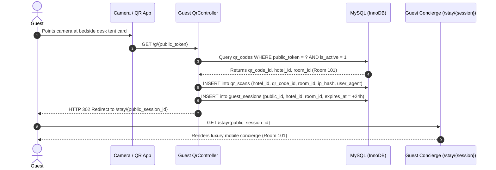

# Permanent QR Code Engine & Print Center

## 1. Architectural Philosophy: The QR Code is the Doorway, Not the Product

> [!IMPORTANT]
> **A QR code printed on luxury acrylic, brass, or laminated cardstock must NEVER expire or require re-printing when operational details change.**

When a boutique hotel renovates:
- Room 101 may be re-designated as "The Presidential Penthouse".
- Room 204 may change floors or Wi-Fi networks.
- Menus, amenities, and branding will evolve over years.

Under our architecture, **the printed QR code is permanent**. It encodes an immutable, unguessable public capability token:
`https://hotel.domain.com/g/fd3ywa4gfuhv9comqlawfuhsmtuvx1bstmwg5wtwbcjrjpls`

The backend resolves the opaque token into the current state of the hotel, room, menu, and guest session in real time.

---

## 2. QR Code Lifecycle & Flow

---

## 3. Cryptographic Security & Anti-Enumeration
1. **No Sequential Auto-Increment IDs**: QR URLs never contain `/qr/1` or `/room/101`.
2. **High-Entropy Tokens**: Tokens are generated via `Str::lower(Str::random(48))` (288 bits of cryptographic entropy), rendering brute-force enumeration mathematically impossible.
3. **No Database Errors on Tampering**: Visiting an altered or non-existent token triggers an immediate, generic HTTP 404 response without exposing database table names or internal exceptions.
4. **GDPR/CCPA Compliant Scan Logging**: Client IP addresses are never stored in plaintext. They are passed through HMAC-SHA256 with the application secret key:
   `hash_hmac('sha256', $request->ip(), config('app.key'))`.

---

## 4. Vector SVG & High-Resolution Print Center
The platform generates pure, scalable vector SVGs directly on the server without calling third-party cloud APIs (e.g., Google Charts), eliminating external privacy leaks.

### Features of the QR Print Center (`/admin/qr-center`):
- **Live Inventory**: Displays all hotel and room QRs with status, scan counts, and last scan timestamps.
- **Instant SVG Vector Download**: Generates crisp, infinite-resolution vector graphics ready for high-end hotel print shops and engravers.
- **Batch Print Sheet (`/admin/qr-center/print`)**: Generates an A4 print layout featuring ready-to-fold desk tent cards with cut and fold guidelines, hotel branding, room numbers, and clear guest instructions:
  - *"Scan with your phone camera to access room dining, housekeeping, reception chat, and hotel amenities."*
