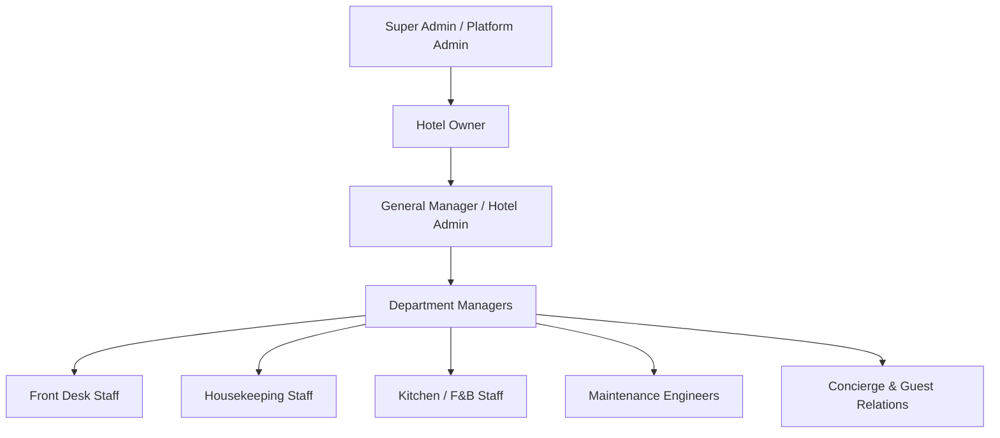

# Role-Based Access Control (RBAC) & Permissions Matrix

## 1. Role Hierarchy & Philosophy
The platform employs a fine-grained, permission-driven authorization model. Staff roles define bundles of permissions, and all authorization checks test for specific capabilities (e.g. `rooms.update`, `orders.view`) rather than hardcoded role names.

---

## 2. Roles Definition

| Role Key | Scope | Description |
| :--- | :--- | :--- |
| `PLATFORM_ADMIN` | Global | Platform operator. Can provision new hotel tenants, manage platform settings, and audit system-wide security logs. |
| `HOTEL_OWNER` | Hotel | Legal owner / franchisee. Full financial, operational, and staff administration rights over their hotel. |
| `HOTEL_ADMIN` | Hotel | General Manager. Full control of hotel rooms, services, restaurant, staff assignments, and analytics. |
| `FRONT_DESK` | Hotel | Reception staff. Manages room occupancy status, guest concierge requests, chats, and wake-up calls. |
| `HOUSEKEEPING` | Hotel | Housekeeping team. Views room cleaning status, fulfills linen and toiletry requests, and marks rooms clean. |
| `KITCHEN` | Hotel | Kitchen display system operator. Receives dining tickets, updates preparation stages, and manages menu availability. |
| `MAINTENANCE` | Hotel | Facilities engineer. Resolves AC, electrical, plumbing, and hardware tickets. |
| `CONCIERGE` | Hotel | Concierge desk. Organizes guest airport transfers, restaurant bookings, and local experiences. |

---

## 3. Permissions Matrix

| Permission Name | Platform Admin | Hotel Owner | Hotel Admin | Front Desk | Housekeeping | Kitchen | Maintenance | Concierge |
| :--- | :---: | :---: | :---: | :---: | :---: | :---: | :---: | :---: |
| `platform.manage` | ✅ | ❌ | ❌ | ❌ | ❌ | ❌ | ❌ | ❌ |
| `hotel.view` | ✅ | ✅ | ✅ | ✅ | ✅ | ✅ | ✅ | ✅ |
| `hotel.update` | ✅ | ✅ | ✅ | ❌ | ❌ | ❌ | ❌ | ❌ |
| `rooms.view` | ✅ | ✅ | ✅ | ✅ | ✅ | ❌ | ✅ | ✅ |
| `rooms.create` | ✅ | ✅ | ✅ | ❌ | ❌ | ❌ | ❌ | ❌ |
| `rooms.update` | ✅ | ✅ | ✅ | ✅ | ✅ | ❌ | ❌ | ❌ |
| `qr.manage` | ✅ | ✅ | ✅ | ✅ | ❌ | ❌ | ❌ | ❌ |
| `requests.view` | ✅ | ✅ | ✅ | ✅ | ✅ | ❌ | ✅ | ✅ |
| `requests.assign` | ✅ | ✅ | ✅ | ✅ | ❌ | ❌ | ❌ | ❌ |
| `requests.update` | ✅ | ✅ | ✅ | ✅ | ✅ | ❌ | ✅ | ✅ |
| `orders.view` | ✅ | ✅ | ✅ | ✅ | ❌ | ✅ | ❌ | ❌ |
| `orders.update` | ✅ | ✅ | ✅ | ✅ | ❌ | ✅ | ❌ | ❌ |
| `menu.manage` | ✅ | ✅ | ✅ | ❌ | ❌ | ✅ | ❌ | ❌ |
| `staff.manage` | ✅ | ✅ | ✅ | ❌ | ❌ | ❌ | ❌ | ❌ |
| `analytics.view` | ✅ | ✅ | ✅ | ❌ | ❌ | ❌ | ❌ | ❌ |
| `audit.view` | ✅ | ✅ | ✅ | ❌ | ❌ | ❌ | ❌ | ❌ |

---

## 4. Enforcement Mechanism
1. **Middleware Layer**: Enforced on web routes via `EnsurePermission` (e.g. `->middleware('permission:rooms.view')`).
2. **Policy Layer**: Enforced on model actions via Laravel Policies (`RoomPolicy`, `OrderPolicy`, `ServiceRequestPolicy`).
3. **Blade Directive**: Elements conditionally displayed with `@can('permission.name')` without replacing server-side validation.
