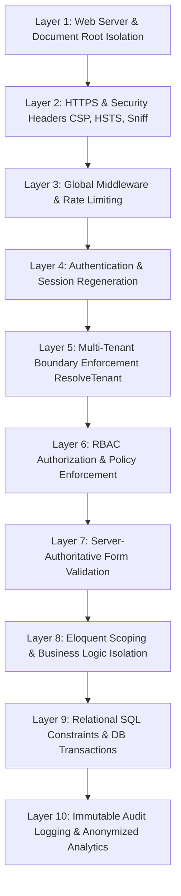

# Enterprise Hospitality Platform — Security Architecture & Threat Model

## 1. Executive Summary & Philosophy
This platform operates under a strict **Zero-Trust, Multi-Tenant Defense-in-Depth** model. Every transaction, query, request, and asset is authenticated, authorized, and strictly scoped to the active tenant property.

Client inputs—including prices, taxes, room identifiers, hotel IDs, and user roles—are never trusted.

---

## 2. Ten-Layer Defense-in-Depth Model

### Layer 1: Web Server & Document Root Isolation
- Only `/public` is exposed to the web server (`public/index.php`).
- `.env`, `/app`, `/bootstrap`, `/config`, `/database`, `/storage`, and `/vendor` reside outside the public document root.
- Dedicated `.htaccess` files in `public/` deny direct directory browsing and execution of PHP scripts in public assets.

### Layer 2: HTTPS & Security Headers
Configured via `app/Http/Middleware/SecurityHeaders.php`:
- `Content-Security-Policy`: Restricts scripts, styles, fonts, frames, and forms to `'self'` and trusted origins.
- `X-Content-Type-Options: nosniff`: Prevents MIME-confusion attacks.
- `X-Frame-Options: DENY`: Protects against clickjacking.
- `Referrer-Policy: strict-origin-when-cross-origin`: Restricts referrer data leakage.
- `Permissions-Policy: camera=(), microphone=(), geolocation=()`: Disables unwanted browser capabilities.
- `Strict-Transport-Security` (HSTS): Enforced in production across all subdomains.

### Layer 3: Rate Limiting & Throttling
Defined in `bootstrap/app.php` using Laravel RateLimiter:
- **Admin Login**: 5 attempts per minute keyed by IP and lowercase email.
- **Password Reset**: 5 attempts per hour.
- **Public QR Scans**: 60 requests per minute per IP.
- **Guest Orders & Requests**: 10 submissions per minute per IP to prevent automated denial-of-service or prank requests.
- **Asynchronous Search (`Ctrl+K`)**: 30 queries per minute per user.

### Layer 4: Authentication & Session Hardening
- Passwords hashed using bcrypt/Argon2 with cost factor 12+.
- Mandatory session regeneration on login via `LoginController::store` to mitigate session fixation attacks.
- Cookies configured with `HttpOnly`, `SameSite=Lax`, and `Secure` flags.
- Complete session invalidation and token destruction upon logout.

### Layer 5: Multi-Tenant Isolation
- The authenticated user's hotel context is resolved exclusively from their active record in `hotel_users`.
- Platform admins can switch properties through `admin/switch-hotel/{hotel}`, requiring explicit verification of the `platform_admin` flag.
- Normal staff can never switch to an unauthorized property. Attempting to access an unauthorized hotel returns `403 Forbidden`.

### Layer 6: RBAC & Policy Gates
- Granular permission system (`hotel.view`, `rooms.view`, `rooms.create`, `rooms.update`, `qr.manage`, `menu.manage`, `requests.view`, `orders.view`, etc.).
- Enforced at route level with `EnsurePermission` middleware.
- Never rely on hiding buttons in Blade; direct URL access without permission results in `403 Forbidden`.

### Layer 7: Form & Request Validation
- Strict server-side FormRequest classes (`StoreRoomRequest`, `StoreOrderRequest`, `StoreServiceRequest`).
- Invariant validation: Client-submitted prices, discounts, and taxes are stripped from requests.

### Layer 8: Eloquent Tenant Scoping
- All tenant-owned models use `BelongsToTenant` trait.
- A global Eloquent query scope automatically injects `WHERE hotel_id = ?` into all `SELECT`, `UPDATE`, and `DELETE` queries.
- Creating an entity with a mismatched `hotel_id` throws an immediate `UnauthorizedException`.

### Layer 9: Relational SQL Constraints & DB Transactions
- Foreign keys with `ON DELETE CASCADE` or `RESTRICT` prevent orphan records.
- Database transactions wrap critical operations (`CreateHotelAction`, `CreateOrderAction`, `CreateServiceRequestAction`) to guarantee ACID compliance.

### Layer 10: Immutable Audit Logging & Anonymized Analytics
- Critical operations (status changes, room configuration, menu adjustments) generate immutable audit records.
- QR scan analytics store HMAC-SHA256 hashes of client IPs (`hash_hmac('sha256', $ip, $appKey)`), preserving guest privacy and complying with GDPR.

---

## 3. Mandatory Security Test Matrix

| Test Case | Scenario | Expected Behavior | Automated Test |
| :--- | :--- | :--- | :--- |
| **IDOR Cross-Tenant** | Hotel A admin requests `/admin/rooms/{hotel_b_room_id}` | `404 Not Found` (Global tenant scope hides the record) | `TenantIsolationTest` |
| **Tampered Pricing** | Guest submits cart with `price: 0.01` | Server recalculates price from DB; client price ignored | `OrderSecurityTest` |
| **Double Order** | Guest double-clicks "Place Order" button | Idempotency key locks request; only 1 order created | `OrderSecurityTest` |
| **Public QR Token Tampering** | Attacker modifies opaque QR token `/g/fake-token` | Clean `404 Not Found`; zero SQL errors or stack traces | `QrSecurityTest` |
| **Platform Boundary** | Hotel staff attempts to access `/platform/hotels` | `403 Forbidden` | `PlatformAdminSecurityTest` |
| **Search Leakage** | Hotel A staff searches for Room `999` existing in Hotel B | Returns only Hotel A results; 0 Hotel B results | `SearchSecurityTest` |
